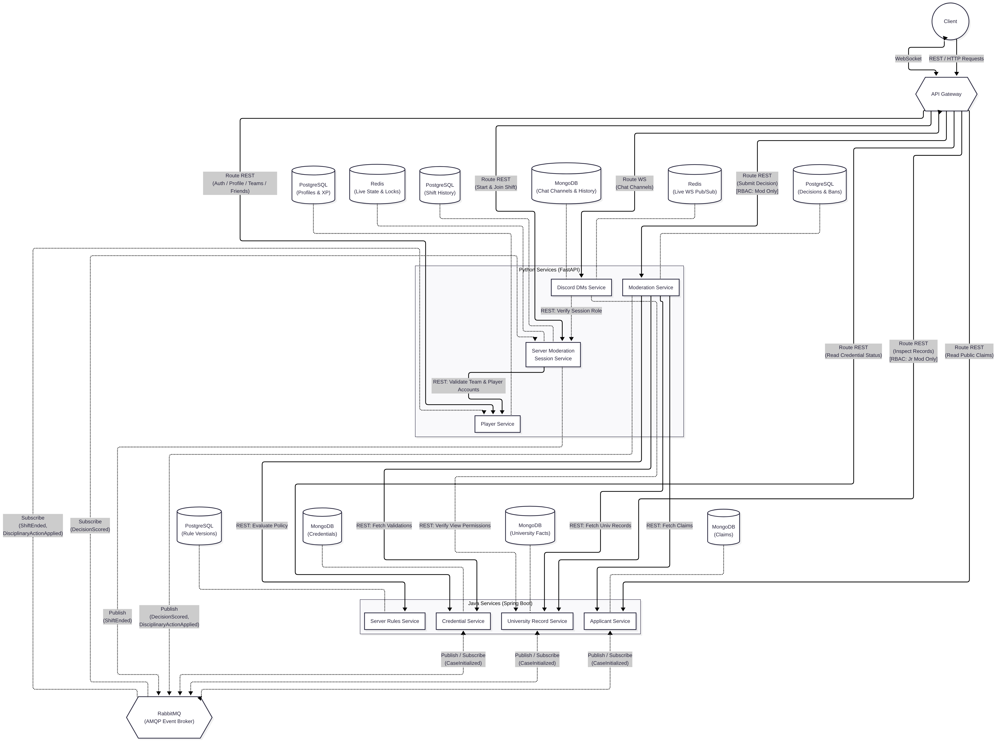

# Topic 3 - Student ID, please

Student ID, please is a game about moderating a university Discord server. The Lab 0 design splits the game into the services listed below. Players compare applicants' claims and credentials with university records and the rules for the current shift.

This README defines the Lab 0 design that the team plans to implement in later labs. The services do not run yet.

During a shift, Junior Moderators can inspect only their assigned records. They share their findings in WebSocket chat channels, and the Moderator decides whether to accept, reject, flag, or ban each applicant. Player progression carries across shifts.

## Table of contents

- [Team overview](#team-overview)
- [Service boundaries](#service-boundaries)
- [Architecture diagram](#architecture-diagram)
- [Technologies and communication patterns](#technologies-and-communication-patterns)
- [Communication contract](#communication-contract)
- [Contribution and workflow guidelines](#contribution-and-workflow-guidelines)
- [Project board](#project-board)

## Team overview

| Developer | Services owned | Language and framework | Repositories |
| :--- | :--- | :--- | :--- |
| Chicu Andrei | Moderation Service<br>Discord DMs Service | Python, FastAPI | [moderation-service](https://github.com/andyp1xe1/pad-moderation-service)<br>[discord-dms-service](https://github.com/andyp1xe1/pad-discord-dms-service) |
| Vremere Adrian | Applicant Service<br>Credential Service | Java, Spring Boot | [applicant-service](https://github.com/mcittkmims/applicant-service)<br>[credential-service](https://github.com/mcittkmims/credential-service) |
| Alexei Maxim | Server Rules Service<br>University Record Service | Java, Spring Boot | [server-rules-service](https://github.com/MaxNoragami/server-rules-service)<br>[university-record-service](https://github.com/MaxNoragami/university-record-service) |
| Cebotari Alexandru | Player Service<br>Server Moderation Session Service | Python, FastAPI | [player-service](https://github.com/Tirppy/student-id-player-service)<br>[session-service](https://github.com/Tirppy/student-id-session-service) |

## Service boundaries

Each service is the sole writer of its data. Other services read that data through APIs or consume events that contain the fields they need. A local projection is a copy, not a new source of truth.

### Player Service

The Player Service owns global player identity and persistent moderator progression:

- player accounts and authentication
- player profiles and friendships
- moderation teams and team membership
- XP, levels, and persistent progression

It updates progression from completed-shift and disciplinary events. It does not own applicants, moderation-session roles, admission decisions, or session scores.

### Server Moderation Session Service

The Server Moderation Session Service owns active Discord moderation shifts:

- moderation-shift creation and lifecycle
- the participant roster and the Moderator or Junior Moderator role assigned to each participant
- the current applicant reference
- the number of processed applications
- the aggregate shift score and penalties

The service consumes individual outcomes from the Moderation Service and calculates the final shift result. When the shift ends, the service publishes that result. The Player Service then applies it to player progression.

It does not own player accounts or progression, applicant details, individual admission decisions, server rules, or chat messages.

### Applicant Service

The Applicant Service generates and stores applicant profiles and presented claims. Claims can include a name, student ID, major, year, university status, course list, and role.

An applicant can claim to be a FAF student, a student from another major, a teaching assistant, a university staff member, an alumnus, or an outsider. The claims may be false or may impersonate another person.

The service does not own submitted credentials, authoritative university records, credential-validation results, or admission decisions.

### Credential Service

The Credential Service validates the structure, authenticity, and integrity of physical or digital documents. It owns:

- documents and credentials presented by an applicant
- structural and authenticity checks
- the validation result for each credential

Credentials can include a student ID, a university email, an enrollment confirmation, or an ELSE course registration. A credential can be expired, forged, inconsistent, or incomplete.

The service does not own the applicant's claimed identity, authoritative university records, access rules, or admission decisions. A valid credential does not by itself grant access to the Discord server.

### Server Rules Service

The Server Rules Service owns versioned rules for accessing the Discord server. It evaluates applicant claims, credential results, university facts, and moderation history against the rule version active for the shift.

Rules can restrict access by major, year, enrollment duration, university role, allowed channels, or an existing ban. The service returns the expected policy result and the rules that matched.

It does not own applicant data, credentials, university records, bans, moderator actions, or scoring. The Moderation Service owns the comparison between the expected policy result and the Moderator's decision.

### University Record Service

The University Record Service owns authoritative university facts, including:

- current enrollment
- Outlook group email membership
- existing courses
- the current academic year
- the semester schedule
- FCIM server message records

The University Record Service also owns the permissions that control which records each Junior Moderator may inspect. The service checks these permissions for every player request.

It does not own applicant claims, submitted credentials, credential-validation results, or admission decisions.

### Moderation Service

The Moderation Service executes admission decisions and checks them against server rules. It owns:

- the Moderator's Accept, Reject, Flag, or Ban action for each applicant
- decision history and active bans
- the server-rule result used for the decision
- the correctness, violated rules, outcome, and penalty for one decision

The Moderation Service gets the required facts from the Applicant, Credential, University Record, and Server Rules services. It compares the Moderator's action with the Server Rules Service result. The service then publishes the outcome to the Server Moderation Session Service.

It does not own the source applicant data, credentials, university records, rule definitions, or aggregate shift score.

### Discord DMs Service

The Discord DMs Service owns moderation channels, channel membership, messages, and real-time message delivery over WebSockets. Session channels can include:

- `#enrollment-check`
- `#faculty-check`
- `#course-registration`
- `#general-mod-chat`

The service uses session roles and university-record permissions when granting channel access. It does not own those roles or permissions. It transports messages but does not verify whether their contents are correct.

### Applicant case initialization

The Server Moderation Session Service sends each new case request to the Applicant, Credential, or University Record service. The selected service creates the authoritative `case_id` and publishes a `CaseInitialized` event that contains the ID and generation payload.

- Each consumer reuses the event's `case_id` and creates only the records that it owns.
- Each consumer enforces `UNIQUE(case_id)` and compares duplicate events with the stored payload. It treats an identical event as a no-op and quarantines a conflicting event.

No service writes to another service's database. The shared `case_id` links the applicant profile, credentials, university records, moderation decision, and session entry across the service databases.

## Architecture diagram



## Technologies and communication patterns

The architecture assigns a language, framework, storage system, and communication method to each service.

| Service | Language and framework | Storage | Communication |
| --- | --- | --- | --- |
| Player | Python, FastAPI | PostgreSQL for accounts, profiles, friendships, teams, and progression | REST<br>Consumes `ShiftEnded` and `DisciplinaryActionApplied` |
| Server Moderation Session | Python, FastAPI | Redis for live state and locks<br>PostgreSQL for shift history | REST<br>Consumes `DecisionScored`<br>Publishes `ShiftEnded` |
| Applicant | Java, Spring Boot | MongoDB for applicant claims and case initialization metadata | REST<br>Publishes and consumes `CaseInitialized` |
| Credential | Java, Spring Boot | MongoDB for credentials and validation results | REST<br>Publishes and consumes `CaseInitialized` |
| Server Rules | Java, Spring Boot | PostgreSQL for immutable rule versions | REST for shift rules and internal policy evaluation |
| University Record | Java, Spring Boot | MongoDB for university facts and record permissions | REST<br>Publishes and consumes `CaseInitialized` |
| Moderation | Python, FastAPI | PostgreSQL for decisions, policy snapshots, bans, and disciplinary actions | REST orchestration<br>Publishes `DecisionScored` and `DisciplinaryActionApplied` |
| Discord DMs | Python, FastAPI | PostgreSQL for channels, memberships, and chat history<br>Redis for chat tickets and WebSocket Pub/Sub | REST for channel and history access<br>WebSockets for live chat |

### Selection rationale and trade-offs

#### Python and FastAPI

Player requests, session coordination, moderation decisions, and live chat spend much of their time waiting for network or storage operations. FastAPI provides typed request models and asynchronous HTTP and WebSocket handlers for this work.

Database and broker clients must not block the event loop. CPU-heavy work must run outside the live-chat request path. Supporting both Python and Java adds tooling, but the project requires two languages.

#### Java and Spring Boot

Applicant generation, document validation, policy evaluation, and university records use structured domain models with explicit constraints. Java types and Spring's validation, security, and transaction support fit these services.

Spring Boot adds its own configuration and build tooling. Using it for the Applicant, Credential, Server Rules, and University Record services gives those services the same implementation conventions. Case generation is deterministic and does not call an external AI service.

#### Storage per service

Each service owns its storage. The Server Moderation Session Service and the Discord DMs Service use PostgreSQL for durable records and Redis for ephemeral state.

- **PostgreSQL:** The Player, Server Moderation Session, Server Rules, Moderation, and Discord DMs services store relational data in PostgreSQL. Local transactions and constraints protect progression ledgers, shift history, outbox entries, rule versions, decisions, bans, chat channels, memberships, and message history.
- **MongoDB:** The Applicant, Credential, and University Record services store document-shaped data in MongoDB. Applicant claims, credentials, and university record types have different fields. The application still validates every document against the contract.
- **Redis:** The Server Moderation Session Service uses Redis for active rosters, case-start locks, and other live shift state. The Discord DMs Service uses Redis for single-use chat tickets and Pub/Sub between WebSocket replicas. Redis does not store durable chat or shift history.

#### REST over HTTP with JSON

Services use REST requests for reads and commands that need an immediate response. Both frameworks support JSON, and the team can inspect JSON during a lab demonstration. HTTP calls do not create a transaction across services, so callers need explicit timeouts, retries, and dependency errors. UUIDs remain strings in JSON in both languages.

#### RabbitMQ with AMQP

Services publish case initialization, decision scoring, and progression events through RabbitMQ. Producers can publish without waiting for consumers to process each event. Consumers must handle delayed and duplicate delivery. The contract uses readiness checks, inbox deduplication, and outbox publishing instead of claiming exactly-once delivery.

#### WebSockets

The Discord DMs Service uses WebSockets to deliver messages during active shifts. It stores each message before broadcast. After a reconnect, clients read missed messages from the REST history endpoint. The service rechecks permissions during each connection.

#### API gateway

The API gateway routes public REST requests and WebSocket upgrades. It verifies player authentication and applies request limits. The gateway is a shared dependency, and each service still checks authorization. The team has not selected the gateway implementation. The gateway is infrastructure, not a domain service.

### Interaction map

The diagram omits some authorization and event paths. This table lists the planned service interactions.

| Caller or producer | Receiver or consumer | Purpose and transport |
| --- | --- | --- |
| Client via gateway | All public service endpoints | Authenticated player commands and permitted reads over REST with JSON |
| Client via gateway | Discord DMs | WebSocket upgrade and chat frames |
| Session | Player | REST: check team and player membership |
| Session | Server Rules, University Record | REST: pin the published rule version and validate permission distribution when starting a shift |
| Session | Applicant, Credential, University Record | Internal REST: initialize a case through one selected service, poll readiness in all three |
| Moderation | Session | Internal REST: verify active shift, assigned Moderator, current case and pinned rules |
| Moderation | Applicant, Credential, University Record | Internal REST: gather complete case facts for scoring |
| Moderation | Server Rules | Internal REST: evaluate case facts, existing bans, and decision history |
| Moderation | Player | Internal REST: validate the target of a disciplinary action |
| Applicant, Credential, Server Rules, University Record, Discord DMs | Session | Internal REST: verify shift participation, roles and lifecycle |
| Discord DMs | University Record | Internal REST: enforce record-derived channel permissions |
| Applicant, Credential, or University Record | The other two case services | RabbitMQ: initialize owned records with the same `case_id` |
| Moderation | Session | RabbitMQ: apply `DecisionScored` once |
| Session | Player | RabbitMQ: apply final `ShiftEnded` progression once |
| Moderation | Player | RabbitMQ: apply `DisciplinaryActionApplied` once |

## Communication contract

### Data ownership and consistency

Each service is the sole writer of its storage. Other services read through the APIs below or maintain local projections from events. A projection is never authoritative. Database foreign keys do not cross service boundaries. Callers validate cross-service UUIDs through the API of the service that owns each UUID. They recheck cached data before authorization-sensitive operations.

University records describe simulated people. A `subject_id` identifies a person in those records, while a `case_id` identifies an application. Bans use `subject_id`, so a new case does not remove an existing ban. An outsider might not have a known `subject_id`.

A service commits a mutation and its pending events in one local transaction through an outbox. The publisher retries until RabbitMQ confirms receipt. A consumer commits its domain update and a unique `(consumer, event_id)` inbox record before it acknowledges the event.

Domain constraints prevent duplicate business operations. These include `UNIQUE(case_id)`, `UNIQUE(session_id, case_id)` for final decisions, and `UNIQUE(session_id)` for applied shift progression. Services do not use distributed transactions. A partly initialized case remains pending, and a downstream failure never becomes a negative admission decision.

### Shared REST conventions

#### Paths and data types

Public gateway paths start with `/api/v1`. Internal paths start with `/internal/v1`, and the gateway does not expose them. Each endpoint belongs to the service named in its section.

Requests and non-empty responses use `application/json`. Field names use `snake_case`.

| Notation | Meaning |
| --- | --- |
| `Id` | UUID string |
| `Time` | RFC 3339 UTC timestamp string |
| `Int` | Signed 32-bit integer |
| `Bool` | Boolean |
| `T[]` | Array of `T` |
| `T?` | Optional field |

`T | null` means that the field is required but can contain `null`. All other fields are required. Scores can be negative. Counts cannot be negative. The objects below use type notation, not JSON syntax.

#### Authentication and authorization

Clients authenticate with `Authorization: Bearer <access_token>`. The Player Service issues tokens. Each service verifies the token signature, issuer, audience, and expiry. Access tokens expire after 15 minutes. Refresh tokens expire after 7 days. The Player Service stores refresh-token hashes, rotates refresh tokens after use, and revokes the refresh session on logout.

Administrators assign global `admin` access. Players cannot select `admin` during registration. The Server Moderation Session Service assigns shift roles. Services never trust a role claim from a client.

Internal calls use service credentials that identify the caller, receiver, and permitted operation. A service credential alone does not authorize a player action. The caller also passes the initiating player's identity in verified authentication context. The receiving service checks that identity against the Server Moderation Session Service. Player-facing responses never contain hidden generation data, expected decisions, or restricted records that belong to another player.

#### Idempotency

Every REST request that changes data includes `Idempotency-Key: <UUID>`. When the same caller retries with the same key, endpoint, and body, the service returns the original status and body. Reusing the key with a different body returns `409`.

Services retain keys and results for the lifetime of the related case or shift. Authentication operations retain them for 24 hours. Clients must not retry an authentication operation after that window. A replay still requires valid authorization. To retry a case-start request, the client uses the same entry service and key. A retry sent to another service is not supported.

#### Pagination

Collection endpoints accept optional `limit: Int` and `cursor: string` query parameters. The default limit is 50, and the valid range is 1 through 100. `Page<T> = {items: T[], next_cursor: string | null}`. A cursor is opaque and applies only to its caller and resource. Results sort by creation time and then by ID. An empty collection returns `200` with `items: []`.

#### Errors and retries

Common error shape: `Error = {code: string, message: string, request_id: Id, details: {field: string, reason: string}[]}`. Do not include hidden facts, secrets, or stack traces.

| Status | Meaning |
| --- | --- |
| `400` | Malformed request |
| `401` | Invalid auth |
| `403` | Insufficient permission |
| `404` | Absent resource |
| `409` | State/key conflict |
| `422` | Invalid field values |
| `429` | Rate limit |
| `503` | Unavailable dependency |

An existing case that is not ready returns `409 CASE_NOT_READY` with `Retry-After: 1`. It does not return an empty result that a caller could treat as an absence of facts. A rate-limit response also includes `Retry-After` in seconds. The endpoint tables list success responses. These common errors apply to every relevant endpoint.

Internal reads time out after 2 seconds. A caller can retry a safe read or a command that carries the original idempotency key. It retries at most twice with backoff. When a dependency fails, the caller returns `503` instead of inventing facts or a decision result. The pagination, timeout, and size values are initial defaults that the team will review during implementation.

Example error response:

```json
{
  "code": "CASE_NOT_READY",
  "message": "Case records are still being initialized.",
  "request_id": "9d1ea947-4194-4897-a8db-71698f62fd2a",
  "details": []
}
```

### Shared domain types

```text
Role = "moderator" | "junior_moderator"
ApplicantRole = "student" | "teaching_assistant" | "staff" | "alumnus" | "outsider"
Action = "accept" | "reject" | "flag" | "ban"
RecordKind = "enrollment" | "outlook_group" | "course" | "academic_year" | "schedule" | "fcim_message"
CredentialKind = "student_id" | "university_email" | "enrollment_confirmation" | "else_registration"
Claims = {name: string, student_id: string | null, major: string | null,
          year: Int | null, university_status: "active" | "inactive" | "graduated" | "none",
          courses: string[], role: ApplicantRole}
Applicant = {case_id: Id, session_id: Id, claims: Claims}
Credential = {credential_id: Id, case_id: Id, kind: CredentialKind,
              holder_name: string, student_id: string | null, issuer: string,
              issued_at: Time, expires_at: Time | null, email: string | null,
              course_ids: string[]}
Validation = {credential_id: Id, structurally_valid: Bool, authentic: Bool,
              expired: Bool, issues: string[], checked_at: Time}
UniversityRecord = {record_id: Id, case_id: Id, kind: RecordKind, subject_id: Id | null,
                    data: Enrollment | OutlookGroup | Course | AcademicYear | Schedule | FcimMessage}
Enrollment = {student_id: string, name: string, major: string, year: Int,
              status: "active" | "inactive" | "graduated", enrolled_since: Time,
              role: ApplicantRole}
OutlookGroup = {email: string, group_name: string, member: Bool}
Course = {course_id: string, title: string, enrolled: Bool}
AcademicYear = {label: string, starts_at: Time, ends_at: Time}
Schedule = {semester: string, course_id: string, starts_at: Time, ends_at: Time}
FcimMessage = {author_name: string, channel: string, text: string, sent_at: Time}
Permission = {session_id: Id, player_id: Id, record_kinds: RecordKind[]}
Ban = {ban_id: Id, subject_id: Id, source_case_id: Id, reason: string, created_at: Time}
PolicyResult = {rule_version: Id, expected_action: Action, allowed_channels: string[],
                matched_rule_ids: Id[], violated_rule_ids: Id[]}
Decision = {decision_id: Id, session_id: Id, case_id: Id, moderator_id: Id,
            action: Action, reason: string, policy: PolicyResult, correct: Bool,
            score_delta: Int, penalty: Int, created_at: Time}
```

`UniversityRecord.data` must match its `kind`. Services reject any other object shape. A `student_id` is an identifier presented by an applicant or stored in a university record. It is never the database key for a case.

An empty record array means that a completed authoritative lookup found no records. Only authorized internal consumers can read the full record set. Players can inspect only the records allowed by their permissions. Credential validation checks documents independently of the access policy. The `authentic` field in a generation input is private metadata and does not appear in a player-visible credential.

### Player Service endpoints

```text
Player = {player_id: Id, username: string, display_name: string, xp: Int, level: Int}
Tokens = {access_token: string, refresh_token: string, expires_in: Int, token_type: "Bearer"}
Team = {team_id: Id, name: string, owner_id: Id, member_ids: Id[]}
Friendship = {friendship_id: Id, requester_id: Id, recipient_id: Id,
              status: "pending" | "accepted"}
```

| Method and path | Authorized caller | Request body or query | Success response |
| --- | --- | --- | --- |
| `POST /api/v1/players` | Anonymous | `{username: string, email: string, password: string, display_name: string}` | `201 Player`<br>Username and email are unique. The service stores a password hash and never returns it. |
| `POST /api/v1/auth/login` | Anonymous | `{email: string, password: string}` | `200 Tokens`<br>Wrong credentials return `401`. |
| `POST /api/v1/auth/refresh` | Refresh-token holder | `{refresh_token: string}` | `200 Tokens`<br>The service atomically revokes the old refresh token. |
| `POST /api/v1/auth/logout` | Refresh-token holder | `{refresh_token: string}` | `204`, no body |
| `GET /api/v1/players/me` | Player | None | `200 Player` |
| `PATCH /api/v1/players/me` | Player | `{display_name: string}` | `200 Player`<br>The request cannot change XP or level. |
| `GET /api/v1/players/{player_id}` | Player | None | `200 Player`<br>The response excludes email, password, and token fields. |
| `POST /api/v1/friendships` | Player | `{recipient_id: Id}` | `201 Friendship` in pending state |
| `PUT /api/v1/friendships/{friendship_id}/acceptance` | Recipient | Empty object | `200 Friendship` in accepted state |
| `GET /api/v1/friendships` | Player | Pagination | `200 Page<Friendship>` for the caller |
| `DELETE /api/v1/friendships/{friendship_id}` | Either participant | None | `204`, no body<br>Removes a friendship or declines a request. |
| `POST /api/v1/teams` | Player | `{name: string}` | `201 Team`<br>The caller becomes the owner and a member. |
| `GET /api/v1/teams/{team_id}` | Team member | None | `200 Team` |
| `POST /api/v1/teams/{team_id}/members` | Team owner | `{player_id: Id}` | `200 Team`<br>The target must be an accepted friend. |
| `DELETE /api/v1/teams/{team_id}/members/{player_id}` | Owner or departing member | None | `200 Team`<br>The owner cannot leave without deleting the team. |
| `DELETE /api/v1/teams/{team_id}` | Owner | None | `204`, no body<br>Historical shift rosters remain snapshots. |
| `GET /internal/v1/players/{player_id}` | Session or Moderation | None | `200 Player` |
| `GET /internal/v1/teams/{team_id}` | Session | None | `200 Team` |

The Player Service consumes progression events. It does not accept client commands that change XP. Each participant receives `max(0, score)` XP when a shift ends. The service stores shift awards and separate disciplinary `xp_penalty` deductions in a progression ledger. Total XP is `max(0, sum(awards) - sum(deductions))`.

The service recalculates XP from the ledger so event delivery order cannot change the result. A player's level is `1 + floor(xp / 100)`. The final shift score already includes decision penalties, so the Player Service does not deduct them again.

### Server Moderation Session Service endpoints

```text
Participant = {player_id: Id, role: Role}
Session = {session_id: Id, team_id: Id, owner_id: Id,
           status: "lobby" | "active" | "ending" | "ended",
           participants: Participant[], rule_version: Id | null, started_at: Time | null,
           current_case_id: Id | null, processed_count: Int, score: Int, penalties: Int}
CaseStatus = {case_id: Id, session_id: Id, state: "pending" | "ready",
              ready_services: ("applicant" | "credential" | "university_record")[]}
SessionContext = {session: Session, player: Participant}
```

| Method and path | Authorized caller | Request body or query | Success response |
| --- | --- | --- | --- |
| `POST /api/v1/sessions` | Team member | `{team_id: Id}` | `201 Session`<br>The caller owns the lobby and starts with the Moderator role. |
| `GET /api/v1/sessions` | Player | Pagination | `200 Page<Session>` for sessions that the caller joined |
| `POST /api/v1/sessions/{session_id}/participants` | Member of that team | Empty object | `200 Session`<br>The caller joins as a Junior Moderator while the lobby is open. |
| `PUT /api/v1/sessions/{session_id}/roles` | Session owner | `{participants: Participant[]}` | `200 Session`<br>The body includes the complete roster with exactly one Moderator. |
| `GET /api/v1/sessions/{session_id}` | Participant | None | `200 Session` |
| `POST /api/v1/sessions/{session_id}/start` | Session owner | Empty object | `200 Session`<br>The service pins the current published rule version and freezes the roster and roles. |
| `POST /api/v1/sessions/{session_id}/cases` | Assigned Moderator | `{entry_service: "applicant" \| "credential" \| "university_record"}` | `202 CaseStatus`<br>The service selects one initializer and reserves the current-case slot. It selects the scenario internally. |
| `GET /api/v1/sessions/{session_id}/cases/{case_id}/status` | Participant | None | `200 CaseStatus`<br>The service queries readiness from all three case owners. |
| `POST /api/v1/sessions/{session_id}/end` | Session owner | Empty object | `202 Session` in `ending`, or `200 Session` if already ended |
| `GET /internal/v1/sessions/{session_id}/context` | Case services, Moderation, Rules, University Record, or DMs | Query `player_id: Id` | `200 SessionContext`<br>The service validates participation. Callers check the required role and status. |

A shift starts with one Moderator and at least two Junior Moderators. The Server Moderation Session Service serializes commands that start a case or end the shift. For each case, it calls one of the three internal initializer endpoints with a stored idempotency key and verified Moderator context. If the response is lost, it retries the same service with the same key. It does not send the retry to another initializer.

Initialization metadata fixes the scenario and seed, including when the request specifies `random`. Each case service initializes its own records. Any of the three case services can receive the initial request, as Topic 3 requires.

Normal gameplay requests the internal `random` scenario. Fixed scenarios are internal test fixtures. Players cannot choose or inspect the hidden scenario or seed. The case-status endpoint reports only readiness.

Only one case can be current. The Server Moderation Session Service allows a new case after it applies `DecisionScored` for the current case. It accepts one event for that case and rejects events for other cases. The service then increments `processed_count`, adds `score_delta`, and accumulates `penalty`.

Ending a shift with a pending or undecided case returns `409`. If a decision is complete but its event is still in transit, the shift remains in `ending`. The Server Moderation Session Service publishes `ShiftEnded` after it counts every accepted decision. Case-start and decision requests reject shifts in `ending` or `ended`. Clients poll `GET /sessions/{session_id}` until the shift ends. A timeout does not mean that the shift has ended.

### Applicant, Credential and University Record initialization

```text
CaseStart = {session_id: Id, scenario: "eligible" | "forged" | "impersonation" | "outsider" | "random"}
CaseAccepted = {case_id: Id, session_id: Id, state: "pending"}
LocalCaseState = {case_id: Id, session_id: Id, state: "pending" | "ready"}
Generation = {scenario: "eligible" | "forged" | "impersonation" | "outsider",
              seed: string, subject_id: Id | null, claims: Claims,
              credentials: {credential: Credential, authentic: Bool}[],
              university_records: UniversityRecord[]}
```

| Method and path | Owner and authorized caller | Request | Success response |
| --- | --- | --- | --- |
| `POST /internal/v1/applicant/cases` | Applicant owns<br>Session calls | `CaseStart` with Moderator context | `202 CaseAccepted` |
| `POST /internal/v1/credential/cases` | Credential owns<br>Session calls | `CaseStart` with Moderator context | `202 CaseAccepted` |
| `POST /internal/v1/university-record/cases` | University Record owns<br>Session calls | `CaseStart` with Moderator context | `202 CaseAccepted` |
| `GET /internal/v1/applicant/cases/{case_id}/status` | Applicant owns<br>Session calls | None | `200 LocalCaseState` |
| `GET /internal/v1/credential/cases/{case_id}/status` | Credential owns<br>Session calls | None | `200 LocalCaseState` |
| `GET /internal/v1/university-record/cases/{case_id}/status` | University Record owns<br>Session calls | None | `200 LocalCaseState` |

The selected initializer creates the `case_id` and a consistent `Generation` payload. It stores only the domain records that it owns and emits `CaseInitialized`. Every ID in the payload must belong to that case. The other two services use the IDs and typed values from the event. They do not generate different facts.

False claims, forged credentials, and impersonation are intentional differences in the payload. In an impersonation case, `subject_id` identifies the simulated applicant, while the presented claims can identify another person.

The payload is an instruction for record generation, not an authoritative database. Each domain owner validates and stores its part. Callers then read the immutable facts from that owner.

Consumers can receive the same event more than once. An identical event is a no-op. A consumer rejects and quarantines conflicting data for the same case. It never overwrites the stored data.

A service marks its local state as ready only after it commits its records. The Server Moderation Session Service marks the case as ready only after all three services report ready. During event propagation, a consumer's `404` response means that the case is still pending. A failed or quarantined initialization remains pending until an operator repairs it. The Moderation Service cannot score a decision before the case is ready. Only the three case services can read hidden generation payloads.

### Applicant Service endpoints

| Method and path | Authorized caller | Request | Success response |
| --- | --- | --- | --- |
| `GET /api/v1/sessions/{session_id}/applicants/{case_id}` | Assigned Moderator in active shift | None | `200 Applicant` with presented claims only |
| `GET /internal/v1/applicants/{case_id}` | Moderation | Query `session_id: Id` | `200 Applicant`<br>The service verifies that the case belongs to the shift. |

### Credential Service endpoints

| Method and path | Authorized caller | Request | Success response |
| --- | --- | --- | --- |
| `GET /api/v1/sessions/{session_id}/cases/{case_id}/credentials` | Assigned Moderator in active shift | Pagination | `200 Page<Credential>` |
| `POST /api/v1/sessions/{session_id}/credentials/{credential_id}/validation` | Assigned Moderator in active shift | Empty object | `200 Validation`<br>The credential must belong to the current case. |
| `GET /internal/v1/cases/{case_id}/credential-results` | Moderation | Query `session_id: Id` | `200 {case_id: Id, credentials: Credential[], validations: Validation[]}` with complete results for every credential |

The internal endpoint runs or reuses deterministic validation even if the player did not request validation. Expiry checks use the shift start time, so a replay cannot change the result during a case. Forgery checks use private authenticity metadata. Credentials do not change during an active case.

### Server Rules Service endpoints

```text
Rule = {rule_id: Id, priority: Int, kind: "major" | "year" | "enrollment_duration" |
        "role" | "ban" | "credential", on_match: Action, allowed_channels: string[],
        condition: MajorCondition | YearCondition | DurationCondition | RoleCondition |
                   BanCondition | CredentialCondition}
MajorCondition = {allowed_majors: string[]}
YearCondition = {min_year: Int, max_year: Int}
DurationCondition = {min_months: Int}
RoleCondition = {roles: ApplicantRole[]}
BanCondition = {active: Bool}
CredentialCondition = {required_kinds: CredentialKind[], require_authentic: Bool, require_unexpired: Bool}
RuleSet = {rule_version: Id, status: "draft" | "published", rules: Rule[],
           default_action: Action, default_channels: string[], created_at: Time}
PolicyInput = {session_id: Id, case_id: Id, rule_version: Id, claims: Claims,
               credentials: Credential[], validations: Validation[],
               university_records: UniversityRecord[], active_bans: Ban[],
               prior_decisions: {action: Action, created_at: Time}[]}
```

| Method and path | Authorized caller | Request | Success response |
| --- | --- | --- | --- |
| `POST /api/v1/rule-versions` | Global admin | `{rules: Rule[], default_action: Action, default_channels: string[]}` | `201 RuleSet` in draft state |
| `POST /api/v1/rule-versions/{rule_version}/publish` | Global admin | Empty object | `200 RuleSet`<br>The version atomically becomes current for future shifts. |
| `GET /api/v1/rule-versions/{rule_version}` | Player | None | `200 RuleSet`<br>Players without `admin` access can read only published versions. |
| `GET /internal/v1/rule-versions/current` | Session | None | `200 RuleSet`<br>If no published version exists, the endpoint returns `409`. |
| `POST /internal/v1/policy/evaluations` | Moderation | `PolicyInput` | `200 PolicyResult`<br>The `rule_version` must match the version pinned to the session. |

The `kind` field identifies each condition type. The `major`, `year`, `duration`, and `credential` conditions match when the applicant fails a requirement. The `role` and `ban` conditions match when the specified role or ban exists.

University facts are authoritative for identity and enrollment checks. The Server Rules Service compares applicant claims with those facts. A material identity mismatch returns `flag` before the service evaluates ordinary access rules. An existing ban for the `subject_id` always returns `ban`. Otherwise, the service evaluates matching rules by ascending priority and resolves equal priorities by rule ID. The first rule determines the action and channels. If no rule matches, the service uses the defaults.

Failed requirements populate `violated_rule_ids`. Every action other than `accept` returns an empty channel list. A month means a completed calendar month at the shift start time. Every credential required by a rule must pass validation. A missing required credential fails the rule.

Published rules and rule versions are immutable. An update creates a new version. The initial contract supports only the listed condition types. A new condition type requires a versioned schema update.

### University Record Service endpoints

| Method and path | Authorized caller | Request | Success response |
| --- | --- | --- | --- |
| `PUT /api/v1/sessions/{session_id}/record-permissions` | Session owner while lobby is open | `{permissions: Permission[]}` | `200 {permissions: Permission[]}`<br>The body replaces all Junior Moderator permissions. |
| `GET /api/v1/sessions/{session_id}/record-permissions/me` | Participant | None | `200 Permission`<br>The Moderator has no direct record permissions. |
| `GET /api/v1/sessions/{session_id}/cases/{case_id}/university-records` | Junior Moderator in active shift | Required query `kind: RecordKind` with pagination | `200 Page<UniversityRecord>`<br>An unassigned `kind` returns `403`. |
| `GET /internal/v1/sessions/{session_id}/record-permissions/{player_id}` | DMs or Session | None | `200 Permission` |
| `GET /internal/v1/cases/{case_id}/university-records` | Moderation | Query `session_id: Id` | `200 {case_id: Id, subject_id: Id \| null, records: UniversityRecord[]}` with all internal facts |

Record permissions do not change after a shift starts. The Server Moderation Session Service checks that at least one Junior Moderator can inspect each record kind. It also rejects an assignment that gives one Junior Moderator every kind. An incomplete or invalid assignment returns `409`. These rules require at least two Junior Moderators.

Players cannot call the internal endpoint that returns all records. The Moderator receives hidden record details from Junior Moderators through DMs. An empty record set is valid for an outsider and does not grant access to restricted records.

### Moderation Service endpoints

```text
Discipline = {disciplinary_action_id: Id, player_id: Id, reason: string,
              xp_penalty: Int, created_at: Time}
```

| Method and path | Authorized caller | Request | Success response |
| --- | --- | --- | --- |
| `POST /api/v1/sessions/{session_id}/decisions` | Assigned Moderator in active shift | `{case_id: Id, action: Action, reason: string}` | `201 Decision`<br>Each current case has one final decision. |
| `GET /api/v1/sessions/{session_id}/decisions` | Participant | Pagination | `200 Page<Decision>` with committed outcomes only |
| `GET /api/v1/sessions/{session_id}/decisions/{decision_id}` | Participant | None | `200 Decision`<br>The service verifies that the decision belongs to the shift. |
| `GET /api/v1/bans` | Global admin | Optional query `subject_id: Id` with pagination | `200 Page<Ban>` |
| `POST /api/v1/disciplinary-actions` | Global admin | `{player_id: Id, reason: string, xp_penalty: Int}` | `201 Discipline`<br>The penalty cannot be negative and is separate from decision scoring. |

Before evaluation, the Moderation Service checks the session context and reads all case data. It sends existing bans and decision history to the Server Rules Service. The service never accepts an expected result from a player. It stores the returned `PolicyResult` with the immutable decision.

A correct action adds 10 points. An incorrect action subtracts 5 points. The `penalty` is 0 for a correct action and 5 for an incorrect action. An action is correct when it equals `expected_action`.

The `flag` action ends the case. The initial contract does not include a later investigation. The `ban` action creates a persistent ban for the `subject_id` in the same transaction as the decision, even when the action is incorrect. If the case has no `subject_id`, a ban request returns `422 SUBJECT_REQUIRED`. Rules must return `reject` or `flag` for an unidentified outsider. A decision with `action: accept` returns the allowed channel names. It does not call the production Discord API.

Before it creates a ban, the Moderation Service evaluates the policy against bans that existed before the decision. It then stores the decision, the new ban, and the outbox event in one transaction. The new ban therefore cannot make its own decision correct.

When different idempotency keys submit decisions at the same time, the first decision wins. Other requests return `409`. A retry with the winning key returns the original result. Players can read a decision result only after commit, and no endpoint previews whether a proposed decision is correct.

### Discord DMs Service endpoints and WebSocket frames

```text
Channel = {channel_id: Id, session_id: Id, name: string, member_ids: Id[]}
Message = {message_id: Id, client_message_id: Id, channel_id: Id,
           author_id: Id, text: string, sent_at: Time}
```

| Method and path | Authorized caller | Request | Success response |
| --- | --- | --- | --- |
| `GET /api/v1/sessions/{session_id}/channels` | Participant | None | `200 {channels: Channel[]}` with only the caller's channels |
| `GET /api/v1/channels/{channel_id}/messages` | Authorized channel member | Pagination | `200 Page<Message>` in chronological order |
| `POST /api/v1/sessions/{session_id}/chat-tickets` | Participant in active shift | Empty object | `201 {ticket: string, expires_at: Time}`<br>The ticket works once, expires after 30 seconds, and belongs to one player and shift. |
| `GET /api/v1/sessions/{session_id}/ws` (upgrade) | Chat-ticket holder | Query `ticket: string` | `101 Switching Protocols`<br>Authentication errors use REST responses before the upgrade. |

The Discord DMs Service stores only a hash of each chat ticket in Redis. The Redis value contains the player and session IDs and expires after 30 seconds. The service uses `GETDEL` to consume the ticket once.

The Discord DMs Service creates the four session channels on first access. A retry does not create duplicate channels. Every participant can join `#general-mod-chat`, and the Moderator can join all channels.

A Junior Moderator can join `#enrollment-check` with enrollment or academic-year access. Outlook-group or FCIM-message access grants entry to `#faculty-check`. Course or schedule access grants entry to `#course-registration`. Channel membership permits discussion of records but does not grant access to additional records.

Before a client connects, reads history, or sends a message, the Discord DMs Service gets the current role from the Server Moderation Session Service. It gets record permissions from the University Record Service. A failed check denies access. After a shift ends, authorized clients can read history, but the service closes live connections with code `1000` and reason `SHIFT_ENDED`. Every 30 seconds, the service rechecks the shift lifecycle and token expiry. An expired token closes the connection with code `1008`. The service redacts query tickets from logs. A consumed or expired ticket cannot reconnect.

All frames are JSON objects:

| Direction and type | Fields | Behavior |
| --- | --- | --- |
| Client `message.send` | `{type: "message.send", client_message_id: Id, channel_id: Id, text: string}` | `text` contains 1 through 2000 characters. The service derives the author from authentication. |
| Server `message.ack` | `{type: "message.ack", client_message_id: Id, message_id: Id}` | Sent to the author after storage. A duplicate `(author_id, client_message_id)` returns the original acknowledgement. |
| Server `message.created` | `{type: "message.created", message: Message}` | Sent only to authorized members. Clients deduplicate by `message_id`. |
| Server `error` | `{type: "error", client_message_id: Id \| null, error: Error}` | Returned for an invalid frame, a permission failure, or a reused ID with different content. The service does not broadcast it. |

The service sends a WebSocket ping every 30 seconds. Two missed pong responses close the connection. A reconnect requires a new chat ticket. The client then recovers history through REST with its last retained pagination cursor. Reusing `client_message_id` makes it safe to retry after a lost acknowledgement. Each channel sorts its history by `(sent_at, message_id)`. Message order across channels is not defined.

When the Discord DMs Service has multiple replicas, each replica subscribes to the same Redis Pub/Sub channel. The service publishes a message only after it commits the message to PostgreSQL. Redis sends the publication to every connected replica, and each replica forwards it to authorized local connections. Redis does not replay missed publications. Clients recover missed messages from PostgreSQL history and deduplicate them by `message_id`.

### RabbitMQ event contract

All events use the durable topic exchange `student-id.events.v1`. Messages use JSON and RabbitMQ persistent delivery. Publishers wait for broker confirms, and consumers acknowledge messages after processing. The `schema_version` is `1`. The event names, routing keys, and payload fields below are fixed. Removing or changing a field requires a new major schema and exchange version. Consumers accept additional optional fields.

```text
Event<T> = {event_id: Id, event_type: string, schema_version: Int,
            occurred_at: Time, producer: "applicant" | "credential" | "university_record" |
            "moderation" | "session", correlation_id: Id, payload: T}
CaseInitializedPayload = {case_id: Id, session_id: Id, generation: Generation}
DecisionScoredPayload = {decision_id: Id, session_id: Id, case_id: Id, moderator_id: Id,
                        action: Action, correct: Bool, score_delta: Int, penalty: Int}
ShiftEndedPayload = {session_id: Id, participant_ids: Id[], processed_count: Int,
                     score: Int, penalties: Int, ended_at: Time}
DisciplinaryPayload = {disciplinary_action_id: Id, player_id: Id, xp_penalty: Int,
                       reason: string}
```

| Event | Routing key | Producer | Durable subscriber queues | Payload and correlation |
| --- | --- | --- | --- | --- |
| `CaseInitialized` | `case.initialized` | Applicant, Credential, or University Record | `applicant.case-initialized.v1`<br>`credential.case-initialized.v1`<br>`university-record.case-initialized.v1` | `CaseInitializedPayload`<br>`correlation_id = case_id` |
| `DecisionScored` | `decision.scored` | Moderation | `session.decision-scored.v1` | `DecisionScoredPayload`<br>`correlation_id = case_id` |
| `ShiftEnded` | `shift.ended` | Session | `player.shift-ended.v1` | `ShiftEndedPayload`<br>`correlation_id = session_id` |
| `DisciplinaryActionApplied` | `discipline.applied` | Moderation | `player.discipline-applied.v1` | `DisciplinaryPayload`<br>`correlation_id = disciplinary_action_id` |

Each subscriber has its own queue. Replicas of one service share that service's queue. An initializer can consume its own case event as a deduplicated no-op, but it never republishes a consumed initialization event. A publication retry uses the original `event_id`. Consumers also deduplicate by the business ID in the payload. This protects against a producer that assigns two event IDs to one case, decision, shift, or disciplinary action.

After a temporary failure, delayed queues retry the message after 1, 5, and 30 seconds. If all retries fail, the message moves to `<subscriber-queue>.dlq`, a durable queue for inspection and replay. A message with an invalid schema or a conflicting payload moves there without a retry. A replay keeps the original IDs and remains idempotent. A consumer never drops a failed message or requeues it without a retry limit.

Broker credentials grant publishers and consumers access only to the exchanges and queues they need. Only the Applicant, Credential, and University Record services can read hidden `CaseInitialized` payloads. A service retains an outbox entry until the broker confirms it. The service retains inbox and domain deduplication records for as long as the related domain records exist.

Example scored event:

```json
{
  "event_id": "d75bfcbd-7c3d-4cc4-95f4-4f2f72bb1304",
  "event_type": "DecisionScored",
  "schema_version": 1,
  "occurred_at": "2026-09-10T10:00:00Z",
  "producer": "moderation",
  "correlation_id": "6b836035-a523-4269-a009-d0a48b3dca0b",
  "payload": {
    "decision_id": "5bbd83b2-c020-4a86-b865-cb3300d360de",
    "session_id": "a5ece187-b773-480f-a777-6626b7fbeb57",
    "case_id": "6b836035-a523-4269-a009-d0a48b3dca0b",
    "moderator_id": "e933b2da-19bb-46b1-a0d5-abb66c359034",
    "action": "accept",
    "correct": true,
    "score_delta": 10,
    "penalty": 0
  }
}
```

### Contract verification scenarios

Before implementation, the developers who own each service review these scenarios together. Implementation PRs cover each relevant scenario with unit or integration tests:

- Initialize a case through each of the three entry services. Every record uses the same `case_id`, hidden data stays internal, and a retry returns the original case.
- Deliver an initialization or scoring event twice. The second delivery does not add records, processed applications, XP, or penalties. A conflicting payload moves to quarantine.
- Delay one case consumer. The case remains pending, and the Moderation Service cannot accept or score a decision from incomplete facts.
- Read university records or send chat messages with the wrong role, permission, or shift. The service denies the request without returning restricted facts.
- Publish new rules during an active shift. The active shift keeps its pinned version, and later shifts use the new version.
- Submit two decisions at the same time. While the scoring event is in transit, end the shift and redeliver the completion event. The system stores one decision and applies one complete progression update.
- Reconnect chat after a lost acknowledgement. The retry does not duplicate the message, and the client recovers stored history.

## Contribution and workflow guidelines

### Branching model

The repository uses `main`, `dev`, and short-lived task branches:

```text
main (stable production releases)
 └── dev (integration of current lab)
      ├── feat/lab-X/service-or-feature
      ├── fix/lab-X/issue-description
      ├── docs/lab-X/update-description
      └── chore/lab-X/task-description
```

#### Naming conventions

`main` holds production-ready releases and receives merges only from `dev` at lab completion. `dev` is the integration branch for the current lab.

| Task | Branch pattern | Example |
| --- | --- | --- |
| Feature | `feat/lab-X/service-or-feature` | `feat/lab-1/player-auth` |
| Fix | `fix/lab-X/issue-description` | `fix/lab-0/submodule-link-error` |
| Documentation | `docs/lab-X/update-description` | `docs/lab-0/communication-contracts` |
| Maintenance | `chore/lab-X/task-description` | `chore/lab-0/update-submodules` |

### Commit conventions

Use [Conventional Commits v1.0.0](https://www.conventionalcommits.org/) for every commit:

`<type>(<scope>): <short summary in imperative mood>`

Use the changed component as the commit scope. Reserve the lab scope for PR titles.

| Type | Use for | Example |
| --- | --- | --- |
| `feat` | New features or service functionality | `feat(game-service): implement websocket cycle timer` |
| `fix` | Bugs, errors, or unwanted behavior | `fix(user-service): fix jwt token expiration validation` |
| `docs` | Documentation only: READMEs, architecture diagrams, API specifications | `docs(readme): add contribution and workflow rules` |
| `style` | Code formatting, such as whitespace or semicolons, without logic changes | `style(player-service): format files according to prettier rules` |
| `refactor` | Code restructuring without behavior changes or new features | `refactor(resource-service): extract database connection logic into helper module` |
| `test` | New or updated unit/integration tests | `test(exam-service): add unit tests for grade calculation endpoints` |
| `chore` | Maintenance, build configuration, dependencies, or submodules | `chore(submodules): link private user-service repository` |

### Merge strategy

| Source | Target | Method | Purpose |
| --- | --- | --- | --- |
| Task branch | `dev` | Squash and Merge | Keep a linear history of completed tasks |
| `dev` | `main` | Rebase and Merge | Preserve milestone history at final lab evaluation |

Delete task branches after merging their PRs into `dev`. Keep `main` and `dev` as permanent branches.

### Versioning strategy

Create version tags only on `main`:

- A completed lab uses `vX.0.0`, such as `v1.0.0` or `v2.0.0`.
- A hotfix uses `vX.0.Y`, such as `v1.0.1`.

### Pull request format

#### PR naming convention

PR titles must use the lab as the Conventional Commits scope:

`<type>(lab-X): <short imperative summary>`

Examples:

- `docs(lab-0): define architecture diagram and workflow rules`
- `feat(lab-1): implement JWT authentication in player service`

#### PR description template

Every PR into `dev` or `main` uses this template:

```markdown
## Why?
[State the problem or goal.]

## Changes
[List the implementation changes.]

## How to Test?
[List the commands and steps that verify the changes. Include the expected results.]

## Screenshots / Evidence (Optional)
[Attach relevant screenshots, test output, or logs.]
```

#### PR review process

Changes enter `main` and `dev` only through PRs. The latest changes need at least one peer approval. Only CPR approvals count. Reviewers must resolve every review thread. All required CI checks and tests must pass. Both branches require linear history and block force pushes and branch deletion. Repository administrators have no configured bypass. Use squash merges for `dev` and rebase merges for `main`.

The required `PR policy` check validates the PR title, source branch, target branch, and description sections. A PR into `main` must come from this repository's `dev` branch. A task PR targets `dev`.

The Lab 0 workflow does not set a coverage target because Lab 0 has no service code. For later implementation PRs, the recommended target is 69% code coverage. Tests focus on business rules, authorization boundaries, security checks, and the main contract flows. The policy does not require exhaustive line coverage.

Reviewers check:

- Code quality, readability, and modularity
- Branch and commit naming
- Test coverage and endpoint functionality
- Security and secret protection

### Example lab workflow

#### 1. Task development

1. Fetch `origin`: `git fetch origin`.
2. Create the task branch from `origin/dev`: `git switch -c <type>/lab-X/<description> origin/dev`.
3. Commit the change: `git commit -m "<type>(<scope>): <summary>"`.
4. Push the branch and open a PR into `dev`.

#### 2. Peer review and integration

1. Request at least one peer approval.
2. Check the CI results, submodule pointers, and changed files for secrets.
3. Resolve every review thread.
4. Squash the PR into `dev`.

#### 3. Lab completion and release

1. After the team completes the lab requirements, open a PR from `dev` to `main`.
2. Run the final tests and verify the submission files.
3. Rebase the PR into `main`.
4. Update local `main`: `git fetch origin && git switch main && git pull --ff-only`. Do not tag the task branch or `dev`.
5. Create and push the release tag: `git tag -a vX.0.0 -m "Lab X completion" && git push origin vX.0.0`.

## Project board

The [GitHub project board](https://github.com/orgs/ChillGuysStudio/projects/2) tracks lab tasks, issues, and status.
