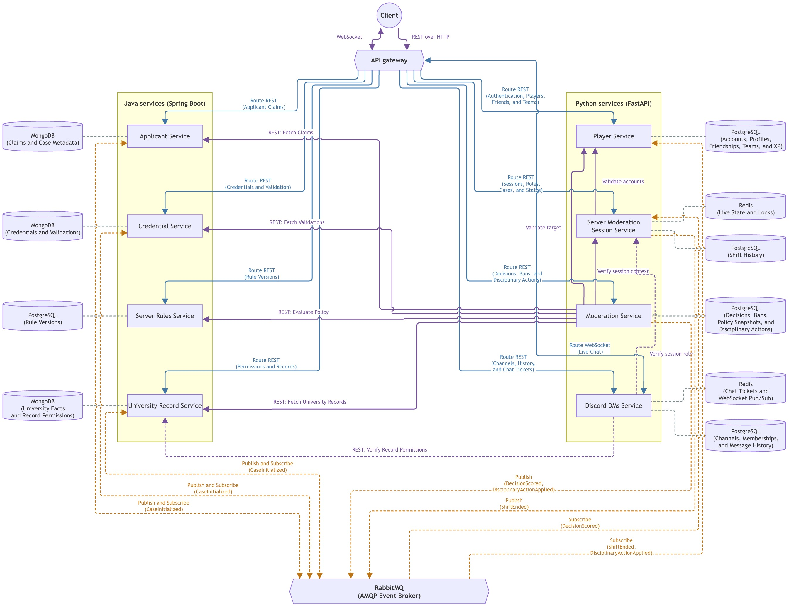

# Topic 3 - Student ID, please

Student ID, please is a game about moderating a university Discord server. The Lab 0 design splits the game into the services listed below. Players compare applicants' claims and credentials with university records and the rules for the current shift.

This README defines the shared service contracts. The Lab 1 Player and Server Moderation Session implementations run together with PostgreSQL, Redis, and RabbitMQ. Session uses contract-compatible mocks for the unavailable teammate services. See [Run the Lab 1 pair](docs/lab1-running.md).

During a shift, Junior Moderators can inspect only their assigned records. They share their findings in WebSocket chat channels, and the Moderator decides whether to accept, reject, flag, or ban each applicant. Player progression carries across shifts.

## Table of contents

- [Lab 1 delivery](#lab-1-delivery)
- [Team overview](#team-overview)
- [Service boundaries](#service-boundaries)
- [Architecture diagram](#architecture-diagram)
- [Technologies and communication patterns](#technologies-and-communication-patterns)
- [Communication contract](#communication-contract)
- [Service integration references](#service-integration-references)
- [Contribution and workflow guidelines](#contribution-and-workflow-guidelines)
- [Project board](#project-board)

## Team overview

| Developer | Services owned | Language and framework | Repositories |
| :--- | :--- | :--- | :--- |
| Chicu Andrei | Moderation Service<br>Discord DMs Service | Python, FastAPI | [moderation-service](https://github.com/andyp1xe1/pad-moderation-service)<br>[discord-dms-service](https://github.com/andyp1xe1/pad-discord-dms-service) |
| Vremere Adrian | Applicant Service<br>Credential Service | Java, Spring Boot | [applicant-service](https://github.com/mcittkmims/applicant-service)<br>[credential-service](https://github.com/mcittkmims/credential-service) |
| Alexei Maxim | Server Rules Service<br>University Record Service | Java, Spring Boot | [server-rules-service](https://github.com/MaxNoragami/server-rules-service)<br>[university-record-service](https://github.com/MaxNoragami/university-record-service) |
| Cebotari Alexandru | Player Service<br>Server Moderation Session Service | Python, FastAPI | [player-service](https://github.com/Tirppy/student-id-player-service)<br>[session-service](https://github.com/Tirppy/student-id-session-service) |

## Service boundaries

Each service is the sole writer of its data. Other services read that data through APIs or consume events that contain the fields they need. A local projection is a copy, not a new source of truth.

Service-specific integration guides: [Player](docs/services/README.player.md), [Server Moderation Session](docs/services/README.session.md), [Applicant](docs/services/README.applicant.md), [Credential](docs/services/README.credential.md), [Server Rules](docs/services/README.server-rules.md), and [University Record](docs/services/README.university-records.md). The shared contract below remains authoritative.

### Player Service

The Player Service owns global player identity and persistent moderator progression:

- player accounts and authentication
- player profiles and friendships
- moderation teams and team membership
- XP, levels, and persistent progression

It updates progression from completed-shift and disciplinary events. It does not own applicants, moderation-session roles, admission decisions, or session scores.

### Server Moderation Session Service

The Server Moderation Session Service owns active Discord moderation shifts:

- moderation-shift creation and lifecycle
- the participant roster and the Moderator or Junior Moderator role assigned to each participant
- the current applicant reference
- the number of processed applications
- the aggregate shift score and penalties

The service consumes individual outcomes from the Moderation Service and calculates the final shift result. When the shift ends, the service publishes that result. The Player Service then applies it to player progression.

It does not own player accounts or progression, applicant details, individual admission decisions, server rules, or chat messages.

### Applicant Service

The Applicant Service generates and stores applicant profiles and presented claims. Claims include separate first and last names, email, student ID, major, year, university status, course list, and role.

An applicant can claim to be a FAF student, a student from another major, a teaching assistant, a university staff member, an alumnus, or an outsider. The claims may be false or may impersonate another person.

The service does not own submitted credentials, authoritative university records, credential-validation results, or admission decisions.

### Credential Service

The Credential Service validates the structure, authenticity, and integrity of physical or digital documents. It owns:

- documents and credentials presented by an applicant
- structural and authenticity checks
- the validation result for each credential

Credentials can include a student ID, a university email, an enrollment confirmation, or an ELSE course registration. A credential can be expired, forged, inconsistent, or incomplete.

The service does not own the applicant's claimed identity, authoritative university records, access rules, or admission decisions. A valid credential does not by itself grant access to the Discord server.

### Server Rules Service

The Server Rules Service owns versioned rules for accessing the Discord server. It evaluates applicant claims, credential results, university facts, and moderation history against the rule version active for the shift.

Rules can restrict access by major, year, enrollment duration, university role, allowed channels, or an existing ban. The service returns the expected policy result and the rules that matched.

It does not own applicant data, credentials, university records, bans, moderator actions, or scoring. The Moderation Service owns the comparison between the expected policy result and the Moderator's decision.

### University Record Service

The University Record Service owns authoritative university facts, including:

- current enrollment
- Outlook group email membership
- existing courses
- the current academic year
- the semester schedule
- FCIM server message records

The University Record Service also owns the permissions that control which records each Junior Moderator may inspect. The service checks these permissions for every player request.

It does not own applicant claims, submitted credentials, credential-validation results, or admission decisions.

### Moderation Service

The Moderation Service executes admission decisions and checks them against server rules. It owns:

- the Moderator's Accept, Reject, Flag, or Ban action for each applicant
- decision history and active bans
- the server-rule result used for the decision
- the correctness, violated rules, outcome, and penalty for one decision

The Moderation Service gets the required facts from the Applicant, Credential, University Record, and Server Rules services. It compares the Moderator's action with the Server Rules Service result. The service then publishes the outcome to the Server Moderation Session Service.

It does not own the source applicant data, credentials, university records, rule definitions, or aggregate shift score.

### Discord DMs Service

The Discord DMs Service owns moderation channels, channel membership, messages, and real-time message delivery over WebSockets. Session channels can include:

- `#enrollment-check`
- `#faculty-check`
- `#course-registration`
- `#general-mod-chat`

The service uses session roles and university-record permissions when granting channel access. It does not own those roles or permissions. It transports messages but does not verify whether their contents are correct.

### Applicant case initialization

The Server Moderation Session Service sends each new case request to the Applicant, Credential, or University Record service. The selected service creates the authoritative `case_id`, generates its own domain data, and publishes one `CaseInitialized` event. The event contains one domain section: claims, credentials, or university records.

- Each consumer reuses the event's `case_id` and derives its records from the source data and shared generation rules instead of receiving ready-made records.
- Each consumer enforces `UNIQUE(case_id)` and compares duplicate events with the stored payload. It treats an identical event as a no-op and quarantines a conflicting event.

No service writes to another service's database. The shared `case_id` links the applicant profile, credentials, university records, moderation decision, and session entry across the service databases.

### Editable data and case snapshots

Each case-data service has two resource lifecycles. Administrators manage reusable Applicant profile presets, Credential document templates, and University reference data through CRUD endpoints. Gameplay creates case snapshots during initialization and reads them afterward. The API has no update or delete endpoints for case snapshots, so reference-data edits leave existing cases unchanged. Credential validation may add a result without changing the document.

Administrators also manage draft rule versions through CRUD endpoints. Publishing freezes a version so the rules for an existing shift remain readable and unchanged. Players cannot edit the evidence used to score their decisions.

## Architecture diagram




## Technologies and communication patterns

The architecture assigns a language, framework, storage system, and communication method to each service.

| Service | Language and framework | Storage | Communication |
| --- | --- | --- | --- |
| Player | Python, FastAPI | PostgreSQL for accounts, profiles, friendships, teams, and progression | REST<br>Consumes `ShiftEnded` and `DisciplinaryActionApplied` |
| Server Moderation Session | Python, FastAPI | Redis for cached live views<br>PostgreSQL for state, transaction locks, and shift history | REST<br>Consumes `DecisionScored`<br>Publishes `ShiftEnded` |
| Applicant | Java, Spring Boot | MongoDB for profile presets, case claims, and initialization metadata | REST<br>Publishes and consumes `CaseInitialized` |
| Credential | Java, Spring Boot | MongoDB for document templates, case credentials, and validation results | REST<br>Publishes and consumes `CaseInitialized` |
| Server Rules | Java, Spring Boot | PostgreSQL for editable drafts and immutable published rule versions | REST for shift rules and internal policy evaluation |
| University Record | Java, Spring Boot | MongoDB for editable reference data, shift snapshots, case facts, and record permissions | REST<br>Publishes and consumes `CaseInitialized` |
| Moderation | Python, FastAPI | PostgreSQL for decisions, policy snapshots, bans, and disciplinary actions | REST orchestration<br>Publishes `DecisionScored` and `DisciplinaryActionApplied` |
| Discord DMs | Python, FastAPI | PostgreSQL for channels, memberships, and chat history<br>Redis for chat tickets and WebSocket Pub/Sub | REST for channel and history access<br>WebSockets for live chat |

### Selection rationale and trade-offs

#### Python and FastAPI

Player requests, session coordination, moderation decisions, and live chat spend much of their time waiting for network or storage operations. FastAPI provides typed request models and asynchronous HTTP and WebSocket handlers for this work.

Database and broker clients must not block the event loop. CPU-heavy work must run outside the live-chat request path. Supporting both Python and Java adds tooling, but the project requires two languages.

#### Java and Spring Boot

Applicant generation, document validation, policy evaluation, and university records use structured domain models with explicit constraints. Java types and Spring's validation, security, and transaction support fit these services.

Spring Boot adds its own configuration and build tooling. Using it for the Applicant, Credential, Server Rules, and University Record services gives those services the same implementation conventions. Case generation is deterministic and does not call an external AI service.

#### Storage per service

Each service owns its storage. The Server Moderation Session Service and the Discord DMs Service use PostgreSQL for durable records and Redis for ephemeral state.

- **PostgreSQL:** The Player, Server Moderation Session, Server Rules, Moderation, and Discord DMs services store relational data in PostgreSQL. Local transactions and constraints protect progression ledgers, shift history, outbox entries, rule versions, decisions, bans, chat channels, memberships, and message history.
- **MongoDB:** The Applicant, Credential, and University Record services store document-shaped data in MongoDB. Applicant claims, credentials, and university record types have different fields. The application still validates every document against the contract.
- **Redis:** The Server Moderation Session Service caches live session views in Redis. Its PostgreSQL transaction locks serialize state changes in Lab 1. The Discord DMs Service uses Redis for single-use chat tickets and Pub/Sub between WebSocket replicas. Redis does not store durable chat or shift history.

#### REST over HTTP with JSON

Services use REST requests for reads and commands that need an immediate response. Both frameworks support JSON, and the team can inspect JSON during a lab demonstration. HTTP calls do not create a transaction across services, so callers need explicit timeouts, retries, and dependency errors. UUIDs remain strings in JSON in both languages.

#### RabbitMQ with AMQP

Services publish case initialization, decision scoring, and progression events through RabbitMQ. Producers can publish without waiting for consumers to process each event. Consumers must handle delayed and duplicate delivery. The contract uses readiness checks, inbox deduplication, and outbox publishing instead of claiming exactly-once delivery.

#### WebSockets

The Discord DMs Service uses WebSockets to deliver messages during active shifts. It stores each message before broadcast. After a reconnect, clients read missed messages from the REST history endpoint. The service rechecks permissions during each connection.

#### API gateway

The API gateway routes public REST requests and WebSocket upgrades. It verifies player authentication and applies request limits. The gateway is a shared dependency, and each service still checks authorization. The team has not selected the gateway implementation. The gateway is infrastructure, not a domain service.

### Interaction map

The diagram omits some authorization and event paths. This table lists the planned service interactions.

| Caller or producer | Receiver or consumer | Purpose and transport |
| --- | --- | --- |
| Client via gateway | All public service endpoints | Authenticated player commands and permitted reads over REST with JSON |
| Client via gateway | Discord DMs | WebSocket upgrade and chat frames |
| Session | Player | REST: check team and player membership |
| Session | Server Rules, University Record | REST: pin rules and a university-data snapshot, and validate permission distribution when starting a shift |
| Applicant, Credential | University Record | Internal REST: read the shift's immutable reference-data snapshot and reserve a new university identity when they initialize |
| Session | Applicant, Credential, University Record | Internal REST: initialize a case through one selected service, poll readiness in all three |
| Moderation | Session | Internal REST: verify active shift, assigned Moderator, current case and pinned rules |
| Moderation | Applicant, Credential, University Record | Internal REST: gather complete case facts for scoring |
| Moderation | Server Rules | Internal REST: evaluate case facts, existing bans, and decision history |
| Moderation | Player | Internal REST: validate the target of a disciplinary action |
| Applicant, Credential, Server Rules, University Record, Discord DMs | Session | Internal REST: verify shift participation, roles and lifecycle |
| Discord DMs | University Record | Internal REST: enforce record-derived channel permissions |
| Applicant, Credential, or University Record | The other two case services | RabbitMQ: derive owned records from the initiator's data using the same `case_id` |
| Moderation | Session | RabbitMQ: apply `DecisionScored` once |
| Session | Player | RabbitMQ: apply final `ShiftEnded` progression once |
| Moderation | Player | RabbitMQ: apply `DisciplinaryActionApplied` once |

## Communication contract

### Data ownership and consistency

Each service is the sole writer of its storage. Other services read through the APIs below or maintain local projections from events. A projection is never authoritative. Database foreign keys do not cross service boundaries. Callers validate cross-service UUIDs through the API of the service that owns each UUID. They recheck cached data before authorization-sensitive operations.

University records describe simulated people. A `subject_id` identifies a person in those records, while a `case_id` identifies an application. Bans use `subject_id`, so a new case does not remove an existing ban. An outsider might not have a known `subject_id`.

A service commits a mutation and its pending events in one local transaction through an outbox. The publisher retries until RabbitMQ confirms receipt. A consumer commits its domain update and a unique `(consumer, event_id)` inbox record before it acknowledges the event.

Domain constraints prevent duplicate business operations. These include `UNIQUE(case_id)`, `UNIQUE(session_id, case_id)` for final decisions, and `UNIQUE(session_id)` for applied shift progression. Services do not use distributed transactions. A partly initialized case remains pending, and a downstream failure never becomes a negative admission decision.

### Shared REST conventions

#### Paths and data types

Public gateway paths start with `/api/v1`. Internal paths start with `/internal/v1`, and the gateway does not expose them. Each endpoint belongs to the service named in its section.

Requests and non-empty responses use `application/json`. Field names use `snake_case`. Services serialize UUIDs in canonical lowercase hyphenated form before comparison or deterministic generation.

| Notation | Meaning |
| --- | --- |
| `Id` | UUID string |
| `Time` | RFC 3339 UTC timestamp string |
| `Int` | Signed 32-bit integer |
| `Bool` | Boolean |
| `T[]` | Array of `T` |
| `T?` | Optional field |

`T | null` means that the field is required but can contain `null`. All other fields are required. Scores can be negative. Counts cannot be negative. The objects below use type notation, not JSON syntax.

#### Authentication and authorization

Clients authenticate with `Authorization: Bearer <access_token>`. The Player Service issues tokens. Each service verifies the token signature, issuer, audience, and expiry. Access tokens expire after 15 minutes. Refresh tokens expire after 7 days. The Player Service stores refresh-token hashes, rotates refresh tokens after use, and revokes the refresh session on logout.

Administrators assign global `admin` access. Players cannot select `admin` during registration. The Server Moderation Session Service assigns shift roles. Services never trust a role claim from a client.

Internal calls use service credentials that identify the caller, receiver, and permitted operation. A service credential alone does not authorize a player action. The caller also passes the initiating player's identity in verified authentication context. The receiving service checks that identity against the Server Moderation Session Service. Player-facing responses never contain hidden generation data, expected decisions, or restricted records that belong to another player.

#### Idempotency

Every REST request that changes data includes `Idempotency-Key: <UUID>`. When the same caller retries with the same key, endpoint, and body, the service returns the original status and body. Reusing the key with a different body returns `409`.

Services retain keys and results for the lifetime of the related case or shift. Authentication and administrative reference-data CRUD retain them for 24 hours. This period includes a delete result after resource removal, and clients must retry within it. Published-version commands retain results with the version. A replay still requires valid authorization. To retry a case-start request, the client uses the same entry service and key. The service rejects a retry sent to another entry service.

#### Pagination

Collection endpoints accept optional `limit: Int` and `cursor: string` query parameters. The default limit is 50, and the valid range is 1 through 100. `Page<T> = {items: T[], next_cursor: string | null}`. A cursor is opaque and applies only to its caller and resource. Results sort by creation time and then by ID. An empty collection returns `200` with `items: []`.

#### Errors and retries

Common error shape: `Error = {code: string, message: string, request_id: Id, details: {field: string, reason: string}[]}`. Do not include hidden facts, secrets, or stack traces.

| Status | Meaning |
| --- | --- |
| `400` | Malformed request |
| `401` | Invalid auth |
| `403` | Insufficient permission |
| `404` | Absent resource |
| `409` | State/key conflict |
| `422` | Invalid field values |
| `429` | Rate limit |
| `503` | Unavailable dependency |

An existing case that is not ready returns `409 CASE_NOT_READY` with `Retry-After: 1`. It does not return an empty result that a caller could treat as an absence of facts. A rate-limit response also includes `Retry-After` in seconds. The endpoint tables list success responses. These common errors apply to every relevant endpoint.

Internal reads time out after 2 seconds. A caller can retry a safe read or a command that carries the original idempotency key. It retries at most twice with backoff. When a dependency fails, the caller returns `503` instead of inventing facts or a decision result. The pagination, timeout, and size values are initial defaults that the team will review during implementation.

Example error response:

```json
{
  "code": "CASE_NOT_READY",
  "message": "Case records are still being initialized.",
  "request_id": "9d1ea947-4194-4897-a8db-71698f62fd2a",
  "details": []
}
```

### Shared domain types

#### Shared enum registry

Services accept the wire values below and reject unknown values instead of mapping them to a local enum.

| Type | Allowed values |
| --- | --- |
| `Scenario` | `eligible`, `forged`, `impersonation`, `outsider` |
| `ApplicantRole` | `student`, `teaching_assistant`, `staff`, `alumnus`, `outsider` |
| `UniversityStatus` | `active`, `inactive`, `graduated`, `none` |
| `CredentialKind` | `student_id`, `university_email`, `enrollment_confirmation`, `else_registration` |
| `ValidationIssue` | `FORGED`, `EXPIRED`, `INCOMPLETE`, `INCONSISTENT` |
| `RecordKind` | `enrollment`, `outlook_group`, `course`, `academic_year`, `schedule`, `fcim_message` |
| `UniversityDataKind` | `program`, `registration`, plus every `RecordKind` |
| `Semester` | `autumn`, `spring` |
| `Action` | `accept`, `reject`, `flag`, `ban` |
| `RuleKind` | `major`, `year`, `enrollment_duration`, `role`, `ban`, `credential` |
| `RuleSetStatus` | `draft`, `published` |
| `LocalCaseState` | `pending`, `ready` |
| `SessionStatus` | `lobby`, `active`, `ending`, `ended` |
| `CaseProducer` | `applicant`, `credential`, `university_record` |

```text
Role = "moderator" | "junior_moderator"
ApplicantRole = "student" | "teaching_assistant" | "staff" | "alumnus" | "outsider"
Action = "accept" | "reject" | "flag" | "ban"
RecordKind = "enrollment" | "outlook_group" | "course" | "academic_year" | "schedule" | "fcim_message"
CredentialKind = "student_id" | "university_email" | "enrollment_confirmation" | "else_registration"
Claims = {first_name: string, last_name: string,
          student_id: string | null, major: string | null, year: Int | null,
          university_status: UniversityStatus,
          courses: string[], role: ApplicantRole, email: string}
Applicant = {case_id: Id, session_id: Id, claims: Claims}
Credential = {credential_id: Id, case_id: Id, kind: CredentialKind,
              holder_first_name: string, holder_last_name: string,
              student_id: string | null, issuer: string,
              issued_at: Time, expires_at: Time | null,
              data: StudentCard | UniversityEmail | EnrollmentProof | ElseRegistration}
StudentCard = {major: string}
UniversityEmail = {email: string, groups: string[], role: ApplicantRole}
EnrollmentProof = {major: string | null, year: Int | null,
                   status: "active" | "inactive" | "graduated", role: ApplicantRole,
                   enrolled_since: Time | null, academic_year: string,
                   confirmation_number: string}
ElseRegistration = {academic_year: string, semester: "autumn" | "spring", course_ids: string[]}
Validation = {credential_id: Id, structurally_valid: Bool, authentic: Bool,
              expired: Bool, issues: string[], checked_at: Time}
UniversityRecord = {record_id: Id, case_id: Id, kind: RecordKind, subject_id: Id | null,
                    data: Enrollment | OutlookGroup | Course | AcademicYear | Schedule | FcimMessage}
Enrollment = {student_id: string | null, first_name: string, last_name: string,
              major: string | null, year: Int | null,
              status: "active" | "inactive" | "graduated", enrolled_since: Time | null,
              role: ApplicantRole}
OutlookGroup = {email: string, group_name: string, member: Bool}
Course = {course_id: string, title: string | null, exists: Bool, enrolled: Bool}
AcademicYear = {label: string, starts_at: Time, ends_at: Time}
Schedule = {semester: string, course_id: string, starts_at: Time, ends_at: Time}
FcimMessage = {author_first_name: string, author_last_name: string,
               channel: string, text: string, sent_at: Time}
Permission = {session_id: Id, player_id: Id, record_kinds: RecordKind[]}
Ban = {ban_id: Id, subject_id: Id, source_case_id: Id, reason: string, created_at: Time}
PolicyResult = {rule_version: Id, expected_action: Action, allowed_channels: string[],
                matched_rule_ids: Id[], violated_rule_ids: Id[], reasons: string[]}
Decision = {decision_id: Id, session_id: Id, case_id: Id, moderator_id: Id,
            action: Action, reason: string, policy: PolicyResult, correct: Bool,
            score_delta: Int, penalty: Int, created_at: Time}
```

`UniversityRecord.data` must match its `kind`. Services reject any other object shape. A `student_id` identifies an applicant or a person in a university record. The `case_id` remains the database key for a case. In initialization events and complete internal responses, document and record arrays sort by kind and then entity UUID. Course-code lists use lexical order. Paginated reads follow the shared pagination order. Readers compare course and group lists as sets and ignore delivery order.

`Credential.data` must match `kind`: `student_id` uses `StudentCard`, `university_email` uses `UniversityEmail`, `enrollment_confirmation` uses `EnrollmentProof`, and `else_registration` uses `ElseRegistration`. The common holder first and last names and `student_id` identify the values printed on that document. `Enrollment` also represents staff affiliation, and staff may have no student ID. `Course.exists = false` requires `title = null` and `enrolled = false`.

An empty record array means that a completed authoritative lookup found no records. Only authorized internal consumers can read the full record set. Players can inspect only the records allowed by their permissions. Credential validation checks documents independently of the access policy. The `authentic` field in a generation input is private metadata and does not appear in a player-visible credential.

### Shared simulation catalog and identity rules

The values below are simulated teaching fixtures. They do not represent an official UTM curriculum or a closed list. Administrators can add programs, courses, academic periods, and university facts through the University data CRUD. The same representation rules apply to new entries.

#### University reference data and snapshots

```text
ProgramDefinition = {code: string, name: string, study_years: Int}
CourseDefinition = {course_id: string, title: string, major: string, year: Int,
                    semester: "autumn" | "spring"}
UniversityRegistration = {course_id: string}
UniversityDataKind = "program" | "registration" | RecordKind
UniversityDataInput = {kind: UniversityDataKind, subject_id: Id | null,
                       data: ProgramDefinition | UniversityRegistration | CourseDefinition | Enrollment |
                             OutlookGroup | AcademicYear | Schedule | FcimMessage}
UniversityData = UniversityDataInput & {reference_id: Id}
UniversitySnapshot = {snapshot_id: Id, session_id: Id, reference_at: Time,
                      entries: UniversityData[]}
IdentityReservationInput = {case_id: Id, subject_id: Id, first_name: string, last_name: string,
                            role: ApplicantRole, university_status: UniversityStatus,
                            major: string | null, admission_year: Int | null}
UniversityIdentity = {subject_id: Id, first_name: string, last_name: string,
                      student_id: string | null, email: string}
```

For reference data, `kind = course` uses `CourseDefinition`; the per-case `Course` type records the result of looking up a course and that person's registration. `kind = registration` links a subject to a course and uses `UniversityRegistration`. Enrollment, registration, Outlook membership, and FCIM messages require a non-null `subject_id`. Programs, course definitions, academic years, and schedules use `subject_id = null`. Each reference subject has one enrollment or affiliation row. Course and program codes are unique, and each `(subject_id, course_id)` pair has one registration. Snapshot creation validates references and rejects overlapping academic periods. Programs last from 1 to 8 years. Course titles and program names contain 1 to 120 characters.

At shift start, Session creates one immutable university snapshot and pins its ID alongside the rule version. Applicant and Credential fetch that snapshot through internal REST, while University reads its copy. The snapshot supplies reusable university data without copying another service's generated case. Services may cache a snapshot by ID but cannot replace it with current editable data. An outage leaves initialization pending or returns `503` before acceptance. Services do not substitute fallback facts.

Editing or deleting live reference data affects future snapshots. Services retain existing snapshots for the lifetime of their shifts and cases. A `snapshot_id` identifies a data snapshot. Generator versions use a separate identifier. Event-schema changes follow the existing RabbitMQ `schema_version` contract.

#### Initial programs and courses

Seed programs are `FAF` (Software Engineering), `IA` (Applied Informatics), `TI` (Information Technology), and `SC` (Computer Systems), each with four study years. A program code contains 2 to 6 uppercase ASCII letters. Course codes contain no more than 32 uppercase letters, digits, or hyphens, and each code is unique. The initial course definitions follow:

| Major | Year | Autumn course and title | Spring course and title |
| --- | --- | --- | --- |
| FAF | 1 | `FAF-PROG1`: Programming Foundations | `FAF-DISCRETE`: Discrete Structures |
| FAF | 2 | `FAF-OOP`: Object-Oriented Design | `FAF-DATA`: Data Structures |
| FAF | 3 | `FAF-NET`: Networked Applications | `FAF-DB`: Database Design |
| FAF | 4 | `FAF-DIST`: Distributed Systems | `FAF-TEST`: Software Testing |
| IA | 1 | `IA-COMP`: Computing Basics | `IA-MATH`: Applied Mathematics |
| IA | 2 | `IA-ALGO`: Algorithms | `IA-STATS`: Statistics |
| IA | 3 | `IA-MODEL`: Data Modeling | `IA-OPT`: Optimization |
| IA | 4 | `IA-ML`: Machine Learning | `IA-VIS`: Data Visualization |
| TI | 1 | `TI-INTRO`: IT Foundations | `TI-WEB`: Web Foundations |
| TI | 2 | `TI-OS`: Operating Systems | `TI-DB`: Database Administration |
| TI | 3 | `TI-SEC`: Systems Security | `TI-OPS`: Service Operations |
| TI | 4 | `TI-CLOUD`: Cloud Applications | `TI-AUDIT`: Infrastructure Audit |
| SC | 1 | `SC-LOGIC`: Digital Logic | `SC-ELEC`: Electronics |
| SC | 2 | `SC-ARCH`: Computer Architecture | `SC-EMBED`: Embedded Programming |
| SC | 3 | `SC-SIGNAL`: Signal Processing | `SC-CTRL`: Control Systems |
| SC | 4 | `SC-RT`: Real-Time Systems | `SC-IOT`: Connected Devices |

`AcademicYear` ranges are half-open: `starts_at <= reference_at < ends_at`. The initial period is `2026-2027`, from `2026-09-01T00:00:00Z` to `2027-09-01T00:00:00Z`. Autumn runs until `2027-02-01T00:00:00Z`, and spring runs until the period ends. Seed one `Schedule` per course for its semester's interval. New periods and schedules are CRUD data. Snapshot creation requires one academic year and unambiguous course schedules at the reference time.

For generated students, course selection uses matching major, year, and current semester, sorted by course code. Select up to the preset's `course_count`; fewer available courses means select all available, including zero. A course cannot be registered if it does not exist. University derives a per-case `Course` row for each selected course. An unknown course claim produces `exists = false` without creating a catalog entry.

#### Person fields and identifiers

| Role / status | Student ID and major | Year | Courses | University email |
| --- | --- | --- | --- | --- |
| `student` / `active` | Present | 1 through program length | Current program/year/semester | Student address |
| `student` / `inactive` | Present | Last study year | Empty | Student address; no active group membership |
| `teaching_assistant` / `active` | Present | 1 through program length | Current program/year/semester | Student address plus teaching-assistant group |
| `staff` / `active` | Both null | Null | Empty | Staff address |
| `alumnus` / `graduated` | Present | Null | Empty | Retained student address; alumni group |
| `outsider` / `none` | Both null | Null | Empty | Personal address |

First and last names are separate, required Unicode strings of 1 to 60 characters. Store each in Unicode NFC. Identity comparison trims ends, collapses internal whitespace, and case-folds each field on its own. Store and transmit the separate fields without a redundant full name. Clients may display `first_name + " " + last_name`. Course lists are sorted sets and cannot be null. Create codes in uppercase and emails in lowercase, then compare their canonical forms.

- Student ID. Use `{MAJOR}-{YY}-{SEQUENCE}`, for example `FAF-25-1`, `FAF-25-2`, then `FAF-25-10`. University allocates a positive, unpadded decimal sequence within `(major, admission_year)` in one transaction. The value must match `^[A-Z]{2,6}-[0-9]{2}-[1-9][0-9]*$`. Simulation admission years run from 2000 to 2099, and the two printed digits must match the stored full year. Sequence numbers increase and remain unavailable after reference deletion. Staff and outsiders have no student ID, while alumni retain their original ID. A presented ID provides evidence but cannot authenticate a user or identify a case.
- Study year. Let `A` be the first year of the pinned academic-year label. For current students, `year = A - admission_year + 1`; require `1 <= year <= study_years`. Generated enrollment starts on September 1 of the admission year. For alumni, use a completed program ending before the current academic year, with no current study year. An existing reference enrollment keeps its stored dates. Policy duration comes from those dates instead of the printed identifier.
- Email local part. Normalize the first and last name to lowercase ASCII as separate values, then join them with a period. Fold `ă/â` to `a`, `î` to `i`, `ș/ş` to `s`, and `ț/ţ` to `t`. Remove remaining combining marks and apostrophes, retain hyphens, collapse whitespace, and remove characters outside `[a-z0-9-]`. Both components must remain non-empty.
- University email. Students, teaching assistants, and alumni use `<first>.<last><suffix>@isa.utm.md`; staff use `<first>.<last><suffix>@utm.md`. The first reservation has no suffix, followed by `1`, `2`, and so on: `eliza.caraman@isa.utm.md`, `eliza.caraman1@isa.utm.md`, `eliza.caraman2@isa.utm.md`. In one transaction, University allocates the lowest unused suffix for `(normalized first, normalized last, domain)`. It does not reuse an address. A later legal-name update leaves the allocated mailbox unchanged. Student groups are `students`, `major:<code>`, and `year:<n>`; add `teaching-assistants` for TAs. Staff use `staff`, alumni use `alumni`. Inactive students retain groups with `member = false`; active affiliations and alumni use `member = true`.
- Outsider email. Outsiders use no university mailbox. Use `<first>.<last><n>@example.net`, where `n` is a deterministic positive value from the case seed. This simulated presented value sits outside University's uniqueness namespace.
- Stable synthetic names. Choose a first name from `[Eliza, Gavril, Iulian, Larisa, Petru, Sabina]` and a last name from `[Bivol, Caraman, Duca, Mocanu, Plesca, Vieru]` using the deterministic choices below. Existing reference subjects keep their names. For name impersonation, choose the presented pair by `case_id` with purposes `presented-first-name` and `presented-last-name`. If either selected field equals the corresponding actual field after normalization, advance to the next candidate in the cycle. The resulting fields differ from the actual names, use names from the lists, and contain no case ID.

Examples of the email normalizer use names not present in the seed catalog:

| First name | Last name | Student mailbox base |
| --- | --- | --- |
| `Cătălin` | `Mîndru` | `catalin.mindru@isa.utm.md` |
| `Sorina-Maria` | `Botezatu` | `sorina-maria.botezatu@isa.utm.md` |
| `Nicolae` | `D'Amico` | `nicolae.damico@isa.utm.md` |

For an existing `subject_id`, reference enrollment and memberships take precedence over generated defaults. Contradictory reference entries fail snapshot validation. For a new university-affiliated subject, the initializer first chooses names and requests one University identity reservation. Applicant and Credential may request the reservation through internal REST, and University runs the same operation inside its service. The response fixes the student ID and university email placed in the source event. Subscribers reuse that identity. An initializer may allocate a new subject UUID but cannot relabel an existing person to bypass a ban.

The reservation is unique by `subject_id` and idempotent by case and idempotency key. Repeating identical data returns the original identity. Changing names, role, major, or admission year for an existing reservation returns `409 IDENTITY_CONFLICT`. University allocates the next student sequence and email suffix in one transaction. A consumed reservation remains allocated after a case-propagation failure, which prevents another person from receiving the same identifiers.

#### Cross-service representation invariants

| ID | Invariant |
| --- | --- |
| `I1` | Every applicant-evidence identity object has separate non-empty `first_name` and `last_name`; no applicant-evidence wire type has a combined person `name`. |
| `I2` | Role/status pairs follow the person-fields table; services reject unknown enum values. |
| `I3` | Students, teaching assistants, and alumni have a reserved student ID and major; staff and outsiders have neither. |
| `I4` | Student IDs match `{MAJOR}-{YY}-{SEQUENCE}` and the stored major/admission year; sequence is positive and unpadded. |
| `I5` | University emails use the role's domain and University's reserved suffix; outsiders never receive a university domain. |
| `I6` | A subject keeps the same reserved student ID and university email across cases; University does not reallocate them. |
| `I7` | Active student/TA courses exist in the pinned program, year, and semester; staff, alumni, inactive students, and outsiders have no current courses. |
| `I8` | Course and group lists are non-null sorted sets; services reject duplicates. |
| `I9` | Exactly one source branch appears in `CaseInitialized`, matching the authenticated producer. |
| `I10` | Only the scenario table's named fields may diverge; `eligible` is evidence consistency, not guaranteed admission. |
| `I11` | Generated case evidence and university snapshots are immutable; CRUD changes affect future snapshots/cases only. |
| `I12` | Empty outsider documents/records are completed evidence and can reach `ready`; missing delivery remains pending. |

#### Credential bundles and defects

Every non-outsider generation bundle includes an enrollment or affiliation confirmation. It provides enough printed identity information for the other services to derive their data when Credential initiates. Staff receive an affiliation confirmation of the same kind with null student fields. The confirmation remains in the document bundle and does not create a separate `claims` section.

| Kind | When generated | Kind-specific data | Default issuer |
| --- | --- | --- | --- |
| `student_id` | Student ID is present | `major` | `SIM-REGISTRY` |
| `university_email` | University affiliation exists | `email`, `groups`, `role` | `SIM-IT` |
| `enrollment_confirmation` | University affiliation exists, including staff and alumni | Major, year, status, role, enrollment date, academic-year label, confirmation number | `SIM-REGISTRY` |
| `else_registration` | At least one current course | Academic year, semester, sorted course IDs | `SIM-ELSE` |

Default issuance is the shift reference time; default expiry is the pinned academic-year end. Historical enrollment dates appear in separate fields. Confirmation numbers use `CONF-<case_id>`. Authentic alumni confirmations prove graduation alone. A genuine alumni document may remain unexpired.

| Defect | Representation | Validation |
| --- | --- | --- |
| Forged | Private `authentic = false` on the enrollment confirmation; printed fields may remain consistent | `authentic = false`, issue `FORGED` |
| Expired | `expires_at <= reference_at` | `expired = true`, issue `EXPIRED` |
| Incomplete | A required printed string is `""` or a required printed list is empty, e.g. the mailbox address | `structurally_valid = false`, issue `INCOMPLETE` |
| Inconsistent | A card's printed major differs from the enrollment confirmation / its own ID | `structurally_valid = false`, issue `INCONSISTENT` |

Typed JSON fields remain present for defective documents. An absent envelope field, wrong JSON type, or mismatched `kind` and `data` causes a contract error. Gameplay defects use valid envelopes. A validator reports each applicable issue in sorted order so one severity label cannot hide another failure. `authentic` describes document issuance. It does not establish whether its bearer tells the truth, and an identity lie does not make each document forged.

The four initial scenarios add no expiry or structure defects. Internal fixtures can apply those defects to generated documents. Generated enrollment identity fields remain complete and provide the derivation anchor. A malformed mailbox address cannot become a new authoritative university email.

### Player Service endpoints

```text
Player = {player_id: Id, username: string, display_name: string, xp: Int, level: Int}
Tokens = {access_token: string, refresh_token: string, expires_in: Int, token_type: "Bearer"}
Team = {team_id: Id, name: string, owner_id: Id, member_ids: Id[]}
Friendship = {friendship_id: Id, requester_id: Id, recipient_id: Id,
              status: "pending" | "accepted"}
```

| Method and path | Authorized caller | Request body or query | Success response |
| --- | --- | --- | --- |
| `POST /api/v1/players` | Anonymous | `{username: string, email: string, password: string, display_name: string}` | `201 Player`<br>Username and email are unique. The service stores a password hash and never returns it. |
| `POST /api/v1/auth/login` | Anonymous | `{email: string, password: string}` | `200 Tokens`<br>Wrong credentials return `401`. |
| `POST /api/v1/auth/refresh` | Refresh-token holder | `{refresh_token: string}` | `200 Tokens`<br>The service atomically revokes the old refresh token. |
| `POST /api/v1/auth/logout` | Refresh-token holder | `{refresh_token: string}` | `204`, no body |
| `GET /api/v1/players/me` | Player | None | `200 Player` |
| `PATCH /api/v1/players/me` | Player | `{display_name: string}` | `200 Player`<br>The request cannot change XP or level. |
| `GET /api/v1/players/{player_id}` | Player | None | `200 Player`<br>The response excludes email, password, and token fields. |
| `POST /api/v1/friendships` | Player | `{recipient_id: Id}` | `201 Friendship` in pending state |
| `PUT /api/v1/friendships/{friendship_id}/acceptance` | Recipient | Empty object | `200 Friendship` in accepted state |
| `GET /api/v1/friendships` | Player | Pagination | `200 Page<Friendship>` for the caller |
| `DELETE /api/v1/friendships/{friendship_id}` | Either participant | None | `204`, no body<br>Removes a friendship or declines a request. |
| `POST /api/v1/teams` | Player | `{name: string}` | `201 Team`<br>The caller becomes the owner and a member. |
| `GET /api/v1/teams/{team_id}` | Team member | None | `200 Team` |
| `POST /api/v1/teams/{team_id}/members` | Team owner | `{player_id: Id}` | `200 Team`<br>The target must be an accepted friend. |
| `DELETE /api/v1/teams/{team_id}/members/{player_id}` | Owner or departing member | None | `200 Team`<br>The owner cannot leave without deleting the team. |
| `DELETE /api/v1/teams/{team_id}` | Owner | None | `204`, no body<br>Historical shift rosters remain snapshots. |
| `GET /internal/v1/players/{player_id}` | Session or Moderation | None | `200 Player` |
| `GET /internal/v1/teams/{team_id}` | Session | None | `200 Team` |

The Player Service consumes progression events. It does not accept client commands that change XP. Each participant receives `max(0, score)` XP when a shift ends. The service stores shift awards and separate disciplinary `xp_penalty` deductions in a progression ledger. Total XP is `max(0, sum(awards) - sum(deductions))`.

The service recalculates XP from the ledger so event delivery order cannot change the result. A player's level is `1 + floor(xp / 100)`. The final shift score already includes decision penalties, so the Player Service does not deduct them again.

### Server Moderation Session Service endpoints

```text
Participant = {player_id: Id, role: Role}
Session = {session_id: Id, team_id: Id, owner_id: Id,
           status: "lobby" | "active" | "ending" | "ended",
           participants: Participant[], rule_version: Id | null, started_at: Time | null,
           university_snapshot_id: Id | null,
           current_case_id: Id | null, processed_count: Int, score: Int, penalties: Int}
CaseStatus = {case_id: Id, session_id: Id, state: "pending" | "ready",
              ready_services: ("applicant" | "credential" | "university_record")[]}
SessionContext = {session: Session, player: Participant}
```

| Method and path | Authorized caller | Request body or query | Success response |
| --- | --- | --- | --- |
| `POST /api/v1/sessions` | Team member | `{team_id: Id}` | `201 Session`<br>The caller owns the lobby and starts with the Moderator role. |
| `GET /api/v1/sessions` | Player | Pagination | `200 Page<Session>` for sessions that the caller joined |
| `POST /api/v1/sessions/{session_id}/participants` | Member of that team | Empty object | `200 Session`<br>The caller joins as a Junior Moderator while the lobby is open. |
| `PUT /api/v1/sessions/{session_id}/roles` | Session owner | `{participants: Participant[]}` | `200 Session`<br>The body includes the complete roster with exactly one Moderator. |
| `GET /api/v1/sessions/{session_id}` | Participant | None | `200 Session` |
| `POST /api/v1/sessions/{session_id}/start` | Session owner | Empty object | `200 Session`<br>Pins the current published rules and a university snapshot; freezes roster and roles. |
| `POST /api/v1/sessions/{session_id}/cases` | Assigned Moderator | `{entry_service: "applicant" \| "credential" \| "university_record"}` | `202 CaseStatus`<br>Calls the selected initializer with internal scenario `random` and reserves the current-case slot. |
| `GET /api/v1/sessions/{session_id}/cases/{case_id}/status` | Participant | None | `200 CaseStatus`<br>The service queries readiness from all three case owners. |
| `POST /api/v1/sessions/{session_id}/end` | Session owner | Empty object | `200 Session` in `ended`, including retries. An unfinished case returns `409`. |
| `GET /internal/v1/sessions/{session_id}/context` | Case services, Moderation, Rules, University Record, or DMs | Query `player_id: Id` | `200 SessionContext`<br>The service validates participation. Callers check the required role and status. |

A shift starts with one Moderator and at least two Junior Moderators. The Server Moderation Session Service serializes commands that start a case or end the shift. For each case, it calls one of the three internal initializer endpoints with a stored idempotency key and verified Moderator context. If the response is lost, it retries the same service with the same key. It does not send the retry to another initializer.

Initialization metadata fixes the scenario and seed, including when the request specifies `random`. Each case service initializes its own records. Any of the three case services can receive the initial request, as Topic 3 requires.

Session reserves `started_at` once for a start attempt and passes it as `reference_at` when creating the university snapshot. A retry uses the same timestamp and idempotency key. The shift stays in the lobby until permissions, rules, and snapshot are available; it never starts with partially pinned configuration. `university_snapshot_id` is a reference only: its hidden contents are not included in public session responses.

Normal gameplay requests the internal `random` scenario. Fixed scenarios are internal test fixtures. Players cannot choose or inspect the hidden scenario or seed. The case-status endpoint reports only readiness.

Only one case can be current. The Server Moderation Session Service allows a new case after it applies `DecisionScored` for the current case. It accepts one event for that case and rejects events for other cases. The service then increments `processed_count`, adds `score_delta`, and accumulates `penalty`.

Ending a shift with a pending or undecided case returns `409`. Lab 1 also returns `409` while a scoring event is in transit. The owner can retry after Session applies the event. Session commits the final result and its `ShiftEnded` outbox entry together, then returns `200`. The worker publishes the event after commit. Case-start and new decision requests reject ended shifts. The `ending` value remains reserved for a later asynchronous completion protocol; Lab 1 does not enter it.

### Applicant, Credential and University Record initialization

```text
CaseStart = {session_id: Id, scenario: "eligible" | "forged" | "impersonation" | "outsider" | "random",
             seed: string?, subject_id: Id?}
CaseAccepted = {case_id: Id, session_id: Id, state: "pending"}
LocalCaseState = {case_id: Id, session_id: Id, state: "pending" | "ready"}
CaseSeed = {case_id: Id, session_id: Id,
            scenario: "eligible" | "forged" | "impersonation" | "outsider",
            seed: string, subject_id: Id | null, university_snapshot_id: Id, reference_at: Time}
GeneratedCredential = {credential: Credential, authentic: Bool}
CaseInitializedPayload =
    CaseSeed & {claims: Claims}
  | CaseSeed & {credentials: GeneratedCredential[]}
  | CaseSeed & {university_records: UniversityRecord[]}
```

| Method and path | Owner and authorized caller | Request | Success response |
| --- | --- | --- | --- |
| `POST /internal/v1/applicant/cases` | Applicant owns<br>Session calls | `CaseStart` with Moderator context | `202 CaseAccepted` |
| `POST /internal/v1/credential/cases` | Credential owns<br>Session calls | `CaseStart` with Moderator context | `202 CaseAccepted` |
| `POST /internal/v1/university-record/cases` | University Record owns<br>Session calls | `CaseStart` with Moderator context | `202 CaseAccepted` |
| `GET /internal/v1/applicant/cases/{case_id}/status` | Applicant owns<br>Session calls | None | `200 LocalCaseState` |
| `GET /internal/v1/credential/cases/{case_id}/status` | Credential owns<br>Session calls | None | `200 LocalCaseState` |
| `GET /internal/v1/university-record/cases/{case_id}/status` | University Record owns<br>Session calls | None | `200 LocalCaseState` |

The event envelope's `producer` is the discriminator: `applicant` requires `claims`, `credential` requires `credentials`, and `university_record` requires `university_records`. Each payload has one domain section, including when its value is an empty array. The payload omits `source` and `generation_version`. Embedded `case_id` values must match the outer case, and entity IDs are unique within their owning service. A record's `subject_id` identifies its person; global academic-year and schedule records have null subjects.

The initializer obtains the snapshot ID and reference time from verified Session context, resolves `random` once, and allocates the case ID and any new subject ID once. It commits its owned records, original event, and idempotency result together. Optional internal `seed` and `subject_id` inputs support reproducible fixtures and returning reference subjects; players cannot supply them. A seed contains 1 to 128 ASCII letters, digits, hyphens, underscores, or periods. Generate a random UUID string if omitted. A supplied subject must have an enrollment or affiliation in the pinned snapshot, or the command returns `422 UNKNOWN_SUBJECT`. The `outsider` scenario requires no subject; supplying one returns `422 INVALID_SCENARIO`. When a subject is supplied with `random`, select from `[eligible, forged, impersonation]`.

Consumers verify that the referenced snapshot belongs to the event's session and has the same `reference_at`. They use the authenticated initializer's original Session authorization and ignore player identities in event data. The Applicant, Credential, and University Record services are the authorized producers of initialization events. Consumers quarantine an event that reuses a snapshot from another shift as a schema or context conflict.

#### Deterministic choices and source precedence

For a bounded choice, calculate SHA-256 over the UTF-8 JSON array `[key, purpose]` with no extra whitespace. Interpret the first eight digest bytes as an unsigned big-endian integer and take modulo the candidate count. Candidates sort by stable code or UUID unless this contract specifies their order. Empty required candidate sets return `409 GENERATION_DATA_UNAVAILABLE`; an optional course list may be empty. Use neither process-global random state nor event delivery order.

Use `seed` for scenario, program, year, and preset choices with purposes `scenario`, `major`, `year`, and `preset`. `random` without a supplied subject selects from `[eligible, forged, impersonation, outsider]`. Program candidates sort by code; year candidates are integers from 1 to that program's length in numeric order. Use `subject_id` (or `case_id` for an outsider) with purposes `first-name` and `last-name` for the name tables. Each service generates credential and record UUIDs with UUIDv5 and namespace `case_id`: `credential:<kind>`, `record:enrollment`, `record:academic_year`, `record:outlook_group:<group_name>`, `record:course:<course_id>`, `record:schedule:<course_id>`, and `record:fcim_message:<reference_id>`. One case may have many documents and records. `UNIQUE(case_id)` protects the aggregate rather than each child row.

Each owner stores its selected reusable preset or template values when it reserves a pending case and before it generates data. Retries reuse the stored selection after an administrator edits or deletes the live template. The seed alone cannot snapshot editable data. Inbox state distinguishes a reserved or pending event from a completed event. A worker resumes pending generation and acknowledges the event after domain completion.

| Owner | As initiator | As subscriber |
| --- | --- | --- |
| Applicant | Select a local profile preset, generate first/last names, reserve a new university identity when applicable, then generate only presented claims | From credentials: use holder first/last names and enrollment proof fields, mailbox email, and ELSE courses. From university records: use enrollment, Outlook membership, and enrolled courses. Apply the prescribed impersonation name pair once. |
| Credential | Generate names and reserve a new university identity when applicable, then build only its document bundle using local templates | From claims: print the supported identity and courses, restoring only the actual first/last pair for impersonation. From university records: print the verified affiliation and registered courses. Apply document authenticity rules below. |
| University Record | Reserve the identity locally and generate its authoritative enrollment/affiliation, memberships, course results, academic year, schedules, and optional FCIM facts | From claims: derive enrollment/affiliation and memberships, restoring only the actual first/last pair for impersonation. From credentials: derive identity from holder/enrollment fields and registrations from ELSE. Check codes and dates against the pinned snapshot; never treat `authentic = false` as an instruction to invent a different enrollment. |

For a new University-initiated subject, use the same active-student defaults as Credential, selecting up to two current-semester courses. Applicant defaults come from its selected preset. For an existing reference subject, all initiators use that subject's recorded facts instead of changing its role or identity through a preset. Existing course registrations come from the snapshot's `registration` entries, limited to courses scheduled for the current semester.

Received source fields form the derivation input. Consumers cannot ignore them and generate a different person from the seed. A source may omit fields it cannot express. For example, an empty outsider document bundle conveys no names, so Applicant uses the deterministic name rule. When a new subject's mailbox is incomplete, a subscriber reads the existing University identity reservation. It does not reconstruct an email from the subject UUID or allocate another suffix. University fills course titles and schedules from its snapshot. The scenario's named differences define the permitted contradictions. Any other contradiction with an existing reference subject causes a conflicting initialization.

#### Scenario divergence rules

| Scenario | Claims | Credentials | University records |
| --- | --- | --- | --- |
| `eligible` | Truthful identity and affiliation | Authentic, structurally valid, unexpired bundle | Confirm identity and affiliation; the role may still fail access policy |
| `forged` | Truthful identity and affiliation | Enrollment confirmation has `authentic = false`; other documents remain authentic | Confirm the actual affiliation even though one supporting document is forged |
| `impersonation` | Replace only `first_name` and `last_name` with the deterministic different presented pair | Genuine documents retain the actual holder fields | Retain the actual subject and names, revealing the contradiction |
| `outsider` | Status `none`, role `outsider`, null student fields, no courses, deterministic personal email | Empty bundle | Empty record set; local state can still be ready |

The first impersonation fixture changes the first and last name alone. Recover the actual pair from the supplied subject's snapshot enrollment or existing identity reservation, then derive the presented pair from the case ID as specified above. All six subscriber paths remain deterministic without a hidden `actual` profile. Full stolen-identity bundles and other lie patterns require new divergence rules shared by all services. The `subject_id` identifies the actual applicant instead of the presented name pair.

`eligible` describes consistent evidence. Server Rules still decides whether to accept the case. Case services do not send the scenario to Server Rules, choose a policy result, or include an expected action in a generation event.

Consumers persist the original producer and normalized payload with their derived records. Duplicate comparison ignores object-key order, while generation arrays use stable order. An identical initialization under the same or a different event ID is a no-op after completion. Different producer, metadata, or source values for the same case go to quarantine without overwriting or rerolling the stored case. A subscriber creates its own domain projection and publishes no new initialization event.

A service marks its local state ready only after committing its records, including a completed empty bundle. Session marks the case ready only when all three owners report ready. During event propagation, a known Session case with a consumer `404` is still pending. Failed or quarantined initialization remains pending for repair. Moderation cannot score it. Only the three case services read hidden initialization payloads; neither readiness responses nor public administrative preset APIs expose them.

### Applicant Service endpoints

```text
ProfilePresetInput = {label: string, role: ApplicantRole,
                      university_status: "active" | "inactive" | "graduated" | "none",
                      major: string | null, year: Int | null, course_count: Int, enabled: Bool}
ProfilePreset = ProfilePresetInput & {preset_id: Id}
```

Presets describe reusable generation choices rather than existing applicants. Labels contain 1 to 120 trimmed characters, and course counts range from 0 to 10. Seed these enabled presets once, with IDs assigned by the service:

| Label | Role | Status | Major | Year | Course count |
| --- | --- | --- | --- | --- | --- |
| FAF first year | `student` | `active` | FAF | 1 | 2 |
| FAF second year | `student` | `active` | FAF | 2 | 2 |
| IA second year | `student` | `active` | IA | 2 | 2 |
| FAF teaching assistant | `teaching_assistant` | `active` | FAF | 4 | 2 |
| University staff | `staff` | `active` | null | null | 0 |
| FAF graduate | `alumnus` | `graduated` | FAF | null | 0 |
| Visitor | `outsider` | `none` | null | null | 0 |

`eligible`, `forged`, and `impersonation` select enabled non-outsider presets compatible with the pinned snapshot; `outsider` uses outsider fields. A new alumni ID uses admission year `A - study_years`; an inactive student uses admission year `A - year + 1`, keeps the preset's last year, and has no courses. Staff have `enrolled_since = null`. Supplied reference subjects take precedence. The Applicant Service validates CRUD syntax, then checks program and course compatibility against the pinned snapshot during generation. An empty compatible preset set fails generation without changing the preset's major or year.

| Method and path | Authorized caller | Request | Success response |
| --- | --- | --- | --- |
| `POST /api/v1/admin/applicant-presets` | Global admin | `ProfilePresetInput` | `201 ProfilePreset` |
| `GET /api/v1/admin/applicant-presets` | Global admin | Pagination | `200 Page<ProfilePreset>` |
| `GET /api/v1/admin/applicant-presets/{preset_id}` | Global admin | None | `200 ProfilePreset` |
| `PUT /api/v1/admin/applicant-presets/{preset_id}` | Global admin | Full `ProfilePresetInput` | `200 ProfilePreset` |
| `DELETE /api/v1/admin/applicant-presets/{preset_id}` | Global admin | None | `204`, no body; existing case snapshots remain |
| `GET /api/v1/sessions/{session_id}/applicants/{case_id}` | Assigned Moderator in active shift | None | `200 Applicant` with presented claims only |
| `GET /internal/v1/applicants/{case_id}` | Moderation | Query `session_id: Id` | `200 Applicant`<br>The service verifies that the case belongs to the shift. |

### Credential Service endpoints

```text
CredentialTemplateInput = {kind: CredentialKind, issuer: string,
                           validity_days: Int | null, enabled: Bool}
CredentialTemplate = CredentialTemplateInput & {template_id: Id}
```

Seed one enabled template per kind using the issuer table and `validity_days = null`, which expires the document at the academic-year end. Issuer contains 1 to 120 characters. A positive number sets expiry to `issued_at + validity_days * 24 hours`. Each kind may have one enabled template; a duplicate returns `409 TEMPLATE_ALREADY_ENABLED`. PUT cannot change a template's kind. Templates control issuance defaults. Field schemas and applicant identities come from the shared contract, and new credential kinds require a schema change. Missing templates for required kinds return `409 GENERATION_DATA_UNAVAILABLE`. Templates produce usable documents. Tests pass expiry and structure defects to the same generator and validator through fixtures instead of public case-edit endpoints.

| Method and path | Authorized caller | Request | Success response |
| --- | --- | --- | --- |
| `POST /api/v1/admin/credential-templates` | Global admin | `CredentialTemplateInput` | `201 CredentialTemplate` |
| `GET /api/v1/admin/credential-templates` | Global admin | Pagination | `200 Page<CredentialTemplate>` |
| `GET /api/v1/admin/credential-templates/{template_id}` | Global admin | None | `200 CredentialTemplate` |
| `PUT /api/v1/admin/credential-templates/{template_id}` | Global admin | Full `CredentialTemplateInput` | `200 CredentialTemplate` |
| `DELETE /api/v1/admin/credential-templates/{template_id}` | Global admin | None | `204`, no body; stored documents and validations remain |
| `GET /api/v1/sessions/{session_id}/cases/{case_id}/credentials` | Assigned Moderator in active shift | Pagination | `200 Page<Credential>` |
| `POST /api/v1/sessions/{session_id}/credentials/{credential_id}/validation` | Assigned Moderator in active shift | Empty object | `200 Validation`<br>The credential must belong to the current case. |
| `GET /internal/v1/cases/{case_id}/credential-results` | Moderation | Query `session_id: Id` | `200 {case_id: Id, credentials: Credential[], validations: Validation[]}` with complete results for every credential |

The internal endpoint runs or reuses deterministic validation even if the player did not request validation. Expiry checks use the shift start time, so a replay cannot change the result during a case. Forgery checks use private authenticity metadata. Credentials do not change during an active case.

### Server Rules Service endpoints

```text
Rule = {rule_id: Id, priority: Int, kind: "major" | "year" | "enrollment_duration" |
        "role" | "ban" | "credential", on_match: Action, allowed_channels: string[],
        applies_to_roles: ApplicantRole[],
        condition: MajorCondition | YearCondition | DurationCondition | RoleCondition |
                   BanCondition | CredentialCondition}
MajorCondition = {allowed_majors: string[]}
YearCondition = {min_year: Int, max_year: Int}
DurationCondition = {min_months: Int}
RoleCondition = {roles: ApplicantRole[]}
BanCondition = {active: Bool}
CredentialCondition = {required_kinds: CredentialKind[], require_authentic: Bool,
                       require_unexpired: Bool, require_structurally_valid: Bool}
RuleSet = {rule_version: Id, status: "draft" | "published", rules: Rule[],
           default_action: Action, default_channels: string[], created_at: Time}
PolicyInput = {session_id: Id, case_id: Id, rule_version: Id, claims: Claims,
               subject_id: Id | null, reference_at: Time,
               credentials: Credential[], validations: Validation[],
               university_records: UniversityRecord[], active_bans: Ban[],
               prior_decisions: {action: Action, created_at: Time}[]}
```

| Method and path | Authorized caller | Request | Success response |
| --- | --- | --- | --- |
| `POST /api/v1/rule-versions` | Global admin | `{rules: Rule[], default_action: Action, default_channels: string[]}` | `201 RuleSet` in draft state |
| `GET /api/v1/admin/rule-versions` | Global admin | Pagination | `200 Page<RuleSet>` including drafts |
| `PUT /api/v1/rule-versions/{rule_version}` | Global admin | `{rules: Rule[], default_action: Action, default_channels: string[]}` | `200 RuleSet`; full replacement of a draft only |
| `DELETE /api/v1/rule-versions/{rule_version}` | Global admin | None | `204`, draft only; published version returns `409 RULE_VERSION_IMMUTABLE` |
| `POST /api/v1/rule-versions/{rule_version}/publish` | Global admin | Empty object | `200 RuleSet`<br>One transaction makes the version current for future shifts. |
| `GET /api/v1/rule-versions/{rule_version}` | Player | None | `200 RuleSet`<br>Players without `admin` access can read only published versions. |
| `GET /internal/v1/rule-versions/current` | Session | None | `200 RuleSet`<br>If no published version exists, the endpoint returns `409`. |
| `POST /internal/v1/policy/evaluations` | Moderation | `PolicyInput` | `200 PolicyResult`<br>The `rule_version` must match the version pinned to the session. |

The `kind` field identifies each condition type. `applies_to_roles = []` means all verified roles; otherwise skip the rule when the verified role is not listed. The `major`, `year`, `enrollment_duration`, and `credential` conditions match when a requirement fails. The `role` and `ban` conditions match when the specified role or ban exists. Prior decision history is accepted for audit context; the initial condition types do not inspect it.

| Fact/check | Authority and missing-value behavior |
| --- | --- |
| Actual person | `subject_id` from University's internal case response; a claimed student ID cannot identify the ban target |
| Major, year, role, status, enrollment date | Case enrollment/affiliation belonging to the actual subject; no enrollment means role `outsider`, status `none`, and null student fields |
| Email and registered courses | Case Outlook memberships and `Course` rows; reference catalogs alone do not prove membership |
| Credential condition | Credential Service validations, one per returned credential; a missing required document fails the requirement, while a missing validation for an existing document returns `422 INVALID_POLICY_INPUT` |
| Duration | Completed calendar months between authoritative `enrolled_since` and the shift reference time; unknown date or non-active status fails a duration requirement |
| Identity consistency | Compare claims and document holder identities with the actual subject's enrollment. Apply the normalization rules to names and compare IDs as written. Academic claims (major/year/status/role/courses) and claimed email must also agree with authoritative facts |
| Time and policy | `reference_at` and `rule_version` must match Session's pinned values; wall-clock time is not used |

Evaluation order is fixed:

1. Validate input completeness, case/session identity, rule version, and reference time. Dependency failure returns `503`, and Rules does not evaluate an unfinished case.
2. An existing ban for the actual non-null subject returns `ban` with reason `EXISTING_BAN`, regardless of documents.
3. A material claim/identity contradiction returns `flag` with reason `EVIDENCE_MISMATCH`. A truthful outsider with no records remains consistent. Credential validation handles malformed or empty printed fields without treating them as proof of a different identity.
4. Evaluate applicable rules in ascending priority, breaking ties by rule UUID. The first matching rule decides the action and channels. Return all matching rule IDs in that order. The `violated_rule_ids` array contains matching failed requirements and an active-ban condition, while positive role matches stay out of it. If none match, use the defaults.

Null major/year fails the corresponding requirement. Non-active enrollment also fails major/year requirements; a role-scoped rule can exempt staff and alumni. A credential requirement fails if a required kind is missing or any supplied document of a required kind fails a check whose flag is true. An empty `required_kinds` applies checks to all supplied documents and does not itself require a document. Structural, authenticity, and expiry checks remain separate. A month is a completed calendar month, clamping the anniversary day to the last day of the target month.

`PolicyResult.reasons` contains these stable codes as applicable: `EXISTING_BAN`, `EVIDENCE_MISMATCH`, `MAJOR_REQUIREMENT`, `YEAR_REQUIREMENT`, `DURATION_REQUIREMENT`, `CREDENTIAL_MISSING`, `CREDENTIAL_STRUCTURE`, `CREDENTIAL_AUTHENTICITY`, `CREDENTIAL_EXPIRED`, `ROLE_MATCH`, `BAN_MATCH`, or `DEFAULT_POLICY`. Deduplicate them in evaluation order. `BAN_MATCH` explains a configurable ban condition, including `active = false`; an existing active ban short-circuits first in normal evaluation. Early built-in results have empty rule-ID arrays because Rules evaluated no configurable rules. Every non-accept action has no channels. If a configured rule or default would ban an unidentified subject, return `reject` and append `SUBJECT_UNIDENTIFIED`. Moderation must receive an action it can execute.

#### Baseline rules fixture

Seed one published ruleset with `default_action = reject` and no default channels. The labels below describe rules; persist real UUIDs as `rule_id`. Administrators can edit this data in future drafts. It contains no hidden scenario mappings.

| Priority | Roles in scope | Condition | Action / channels |
| --- | --- | --- | --- |
| 10 | `student`, `teaching_assistant`, `staff`, `alumnus` | Credential: required enrollment confirmation; require structure only | `flag` / none |
| 11 | All | Credential: all supplied kinds; require structure only | `flag` / none |
| 20 | All | Credential: all supplied kinds; require authenticity only | `ban` / none |
| 30 | All | Credential: all supplied kinds; require unexpired only | `reject` / none |
| 40 | `student`, `teaching_assistant` | Major allowed: `[FAF]` | `reject` / none |
| 50 | `student`, `teaching_assistant` | Year range: 1 to 4 | `reject` / none |
| 60 | `student` | Year range: 2 to 4 | `accept` / `general` (first-year limitation) |
| 70 | All | Role is `staff` or `teaching_assistant` | `accept` / `general`, `teachers` |
| 80 | All | Role is `student` | `accept` / `general`, `dark-memes`, `groapa` |
| 90 | All | Role is `alumnus` | `accept` / `general`, `alumni` |

For credential rows, unmentioned check flags are false; priorities 11, 20, and 30 use `required_kinds = []`. The priority-10 role scope lets a truthful outsider reach the default `reject`. An active FAF year 2 `eligible` case is accepted; an honest IA student is rejected; a forged confirmation leads to `ban`; the name-impersonation fixture leads to `flag`; an outsider is rejected. An existing subject ban overrides all five examples. The baseline handles unresolved document structure before authenticity failures. Changing that priority requires a new ruleset rather than a validator change. A later ruleset can add a 24-month duration requirement without changing the generator.

Rules does not subscribe to `CaseInitialized`, fetch generator presets, or receive `seed`, `scenario`, or private generation authenticity flags. It receives the normal `Validation.authentic` result. It may share enum definitions and comparison conventions, but must not regenerate an answer from a seed. Published versions are immutable and retained; an update creates a new draft. New condition types require a versioned schema update.

### University Record Service endpoints

| Method and path | Authorized caller | Request | Success response |
| --- | --- | --- | --- |
| `POST /api/v1/admin/university-data` | Global admin | `UniversityDataInput` | `201 UniversityData` |
| `GET /api/v1/admin/university-data` | Global admin | Pagination; optional `kind: UniversityDataKind`, `subject_id: Id` | `200 Page<UniversityData>` |
| `GET /api/v1/admin/university-data/{reference_id}` | Global admin | None | `200 UniversityData` |
| `PUT /api/v1/admin/university-data/{reference_id}` | Global admin | Full `UniversityDataInput` | `200 UniversityData`; kind, subject, and natural code cannot change |
| `DELETE /api/v1/admin/university-data/{reference_id}` | Global admin | None | `204`; live references block deletion with `409 REFERENCE_IN_USE`, snapshots do not |
| `POST /internal/v1/university-identities/reservations` | Applicant, Credential, or University Record initializer | `IdentityReservationInput` | `200 UniversityIdentity`; reserves an unpadded student sequence and university-email suffix in one transaction |
| `GET /internal/v1/university-identities/{subject_id}` | Applicant, Credential, or University Record subscriber | Query `case_id: Id` | `200 UniversityIdentity`; reads an existing reservation for derivation without allocating one |
| `POST /internal/v1/university-snapshots` | Session | `{session_id: Id, reference_at: Time}` | `201 {snapshot_id: Id, session_id: Id, reference_at: Time}`; copies and validates current reference data in one transaction |
| `GET /internal/v1/university-snapshots/{snapshot_id}` | Applicant, Credential, University Record, or Session | None | `200 UniversitySnapshot`; full immutable reference data, internal only |
| `PUT /api/v1/sessions/{session_id}/record-permissions` | Session owner while lobby is open | `{permissions: Permission[]}` | `200 {permissions: Permission[]}`<br>The body replaces all Junior Moderator permissions. |
| `GET /api/v1/sessions/{session_id}/record-permissions/me` | Participant | None | `200 Permission`<br>The Moderator has no direct record permissions. |
| `GET /api/v1/sessions/{session_id}/cases/{case_id}/university-records` | Junior Moderator in active shift | Required query `kind: RecordKind` with pagination | `200 Page<UniversityRecord>`<br>An unassigned `kind` returns `403`. |
| `GET /internal/v1/sessions/{session_id}/record-permissions/{player_id}` | DMs or Session | None | `200 Permission` |
| `GET /internal/v1/cases/{case_id}/university-records` | Moderation | Query `session_id: Id` | `200 {case_id: Id, subject_id: Id \| null, records: UniversityRecord[]}` with all internal facts |

Record permissions do not change after a shift starts. The Server Moderation Session Service checks that at least one Junior Moderator can inspect each record kind. It also rejects an assignment that gives one Junior Moderator every kind. An incomplete or invalid assignment returns `409`. These rules require at least two Junior Moderators.

Players cannot call the internal endpoint that returns all records. The Moderator receives hidden record details from Junior Moderators through DMs. An empty record set is valid for an outsider and does not grant access to restricted records.

University reference CRUD accepts entries of existing kinds. Adding a course or person requires no schema change, while a new kind or required field requires a shared schema update. Updates replace the full resource; the API accepts no arbitrary JSON patches. Reference subjects must obey the person-field table, and student IDs and canonical emails are unique among them. Administrators must remove live dependents before deleting a referenced program, course, or subject affiliation. Case snapshots contain copied values and remain intact after live reference deletion. The API provides no PUT, PATCH, or DELETE for generated case records or immutable university snapshots.

Identity reservation is an internal University operation rather than a general Applicant CRUD endpoint. The initializer forwards the signed Session context received with `CaseStart`. University verifies the session and selected initializer, then binds the authenticated service's proposed case ID and subject to the reservation before Session receives `CaseAccepted`. Subscribers issue GET requests after propagation and verify the persisted Session case. The API uses case-oriented paths such as `/internal/v1/{service}/cases`. It omits the reference project's `/api/v1/applicants/next` endpoint and its claimed/actual whole-person payload.

### Moderation Service endpoints

```text
Discipline = {disciplinary_action_id: Id, player_id: Id, reason: string,
              xp_penalty: Int, created_at: Time}
```

| Method and path | Authorized caller | Request | Success response |
| --- | --- | --- | --- |
| `POST /api/v1/sessions/{session_id}/decisions` | Assigned Moderator in active shift | `{case_id: Id, action: Action, reason: string}` | `201 Decision`<br>Each current case has one final decision. |
| `GET /api/v1/sessions/{session_id}/decisions` | Participant | Pagination | `200 Page<Decision>` with committed outcomes only |
| `GET /api/v1/sessions/{session_id}/decisions/{decision_id}` | Participant | None | `200 Decision`<br>The service verifies that the decision belongs to the shift. |
| `GET /api/v1/bans` | Global admin | Optional query `subject_id: Id` with pagination | `200 Page<Ban>` |
| `POST /api/v1/disciplinary-actions` | Global admin | `{player_id: Id, reason: string, xp_penalty: Int}` | `201 Discipline`<br>The penalty cannot be negative and is separate from decision scoring. |

Before evaluation, the Moderation Service checks session context and readiness in all three services, then reads all case data. It takes the actual `subject_id` from University's internal response and uses it for existing bans and history. It sends those facts and the pinned `reference_at` to Server Rules. It excludes generator metadata and any player-supplied expected result. It stores the returned `PolicyResult` with the immutable decision.

A correct action adds 10 points. An incorrect action subtracts 5 points. The `penalty` is 0 for a correct action and 5 for an incorrect action. An action is correct when it equals `expected_action`.

The `flag` action ends the case. The initial contract does not include a later investigation. The `ban` action creates a persistent ban for the `subject_id` in the same transaction as the decision, even when the action is incorrect. If the case has no `subject_id`, a ban request returns `422 SUBJECT_REQUIRED`. Rules must return `reject` or `flag` for an unidentified outsider. A decision with `action: accept` returns the allowed channel names. It does not call the production Discord API.

Before it creates a ban, the Moderation Service evaluates the policy against bans that existed before the decision. It then stores the decision, the new ban, and the outbox event in one transaction. The new ban therefore cannot make its own decision correct.

When different idempotency keys submit decisions at the same time, the first decision wins. Other requests return `409`. A retry with the winning key returns the original result. Players can read a decision result only after commit, and no endpoint previews whether a proposed decision is correct.

### Discord DMs Service endpoints and WebSocket frames

```text
Channel = {channel_id: Id, session_id: Id, name: string, member_ids: Id[]}
Message = {message_id: Id, client_message_id: Id, channel_id: Id,
           author_id: Id, text: string, sent_at: Time}
```

| Method and path | Authorized caller | Request | Success response |
| --- | --- | --- | --- |
| `GET /api/v1/sessions/{session_id}/channels` | Participant | None | `200 {channels: Channel[]}` with only the caller's channels |
| `GET /api/v1/channels/{channel_id}/messages` | Authorized channel member | Pagination | `200 Page<Message>` in chronological order |
| `POST /api/v1/sessions/{session_id}/chat-tickets` | Participant in active shift | Empty object | `201 {ticket: string, expires_at: Time}`<br>The ticket works once, expires after 30 seconds, and belongs to one player and shift. |
| `GET /api/v1/sessions/{session_id}/ws` (upgrade) | Chat-ticket holder | Query `ticket: string` | `101 Switching Protocols`<br>Authentication errors use REST responses before the upgrade. |

The Discord DMs Service stores only a hash of each chat ticket in Redis. The Redis value contains the player and session IDs and expires after 30 seconds. The service uses `GETDEL` to consume the ticket once.

The Discord DMs Service creates the four session channels on first access. A retry does not create duplicate channels. Every participant can join `#general-mod-chat`, and the Moderator can join all channels.

A Junior Moderator can join `#enrollment-check` with enrollment or academic-year access. Outlook-group or FCIM-message access grants entry to `#faculty-check`. Course or schedule access grants entry to `#course-registration`. Channel membership permits discussion of records but does not grant access to additional records.

Before a client connects, reads history, or sends a message, the Discord DMs Service gets the current role from the Server Moderation Session Service. It gets record permissions from the University Record Service. A failed check denies access. After a shift ends, authorized clients can read history, but the service closes live connections with code `1000` and reason `SHIFT_ENDED`. Every 30 seconds, the service rechecks the shift lifecycle and token expiry. An expired token closes the connection with code `1008`. The service redacts query tickets from logs. A consumed or expired ticket cannot reconnect.

All frames are JSON objects:

| Direction and type | Fields | Behavior |
| --- | --- | --- |
| Client `message.send` | `{type: "message.send", client_message_id: Id, channel_id: Id, text: string}` | `text` contains 1 through 2000 characters. The service derives the author from authentication. |
| Server `message.ack` | `{type: "message.ack", client_message_id: Id, message_id: Id}` | Sent to the author after storage. A duplicate `(author_id, client_message_id)` returns the original acknowledgement. |
| Server `message.created` | `{type: "message.created", message: Message}` | Sent only to authorized members. Clients deduplicate by `message_id`. |
| Server `error` | `{type: "error", client_message_id: Id \| null, error: Error}` | Returned for an invalid frame, a permission failure, or a reused ID with different content. The service does not broadcast it. |

The service sends a WebSocket ping every 30 seconds. Two missed pong responses close the connection. A reconnect requires a new chat ticket. The client then recovers history through REST with its last retained pagination cursor. Reusing `client_message_id` makes it safe to retry after a lost acknowledgement. Each channel sorts its history by `(sent_at, message_id)`. Message order across channels is not defined.

When the Discord DMs Service has multiple replicas, each replica subscribes to the same Redis Pub/Sub channel. The service publishes a message only after it commits the message to PostgreSQL. Redis sends the publication to every connected replica, and each replica forwards it to authorized local connections. Redis does not replay missed publications. Clients recover missed messages from PostgreSQL history and deduplicate them by `message_id`.

### RabbitMQ event contract

All events use the durable topic exchange `student-id.events.v1`. Messages use JSON and RabbitMQ persistent delivery. Publishers wait for broker confirms, and consumers acknowledge messages after processing. The `schema_version` is `1`. The event names, routing keys, and payload fields below are fixed. Removing or changing a field requires a new major schema and exchange version. Consumers accept additional optional fields.

```text
Event<T> = {event_id: Id, event_type: string, schema_version: Int,
            occurred_at: Time, producer: "applicant" | "credential" | "university_record" |
            "moderation" | "session", correlation_id: Id, payload: T}
// CaseInitializedPayload is the three-variant union in the initialization section.
DecisionScoredPayload = {decision_id: Id, session_id: Id, case_id: Id, moderator_id: Id,
                        action: Action, correct: Bool, score_delta: Int, penalty: Int}
ShiftEndedPayload = {session_id: Id, participant_ids: Id[], processed_count: Int,
                     score: Int, penalties: Int, ended_at: Time}
DisciplinaryPayload = {disciplinary_action_id: Id, player_id: Id, xp_penalty: Int,
                       reason: string}
```

| Event | Routing key | Producer | Durable subscriber queues | Payload and correlation |
| --- | --- | --- | --- | --- |
| `CaseInitialized` | `case.initialized` | Applicant, Credential, or University Record | `applicant.case-initialized.v1`<br>`credential.case-initialized.v1`<br>`university-record.case-initialized.v1` | `CaseInitializedPayload`<br>`correlation_id = case_id` |
| `DecisionScored` | `decision.scored` | Moderation | `session.decision-scored.v1` | `DecisionScoredPayload`<br>`correlation_id = case_id` |
| `ShiftEnded` | `shift.ended` | Session | `player.shift-ended.v1` | `ShiftEndedPayload`<br>`correlation_id = session_id` |
| `DisciplinaryActionApplied` | `discipline.applied` | Moderation | `player.discipline-applied.v1` | `DisciplinaryPayload`<br>`correlation_id = disciplinary_action_id` |

Each subscriber has its own queue. Replicas of one service share that service's queue. An initializer can consume its own case event as a deduplicated no-op, but it never republishes a consumed initialization event. A publication retry uses the original `event_id`. Consumers also deduplicate by the business ID in the payload. This protects against a producer that assigns two event IDs to one case, decision, shift, or disciplinary action.

After a temporary failure, delayed queues retry the message after 1, 5, and 30 seconds. If all retries fail, the message moves to `<subscriber-queue>.dlq`, a durable queue for inspection and replay. A message with an invalid schema or a conflicting payload moves there without a retry. A replay keeps the original IDs and remains idempotent. A consumer never drops a failed message or requeues it without a retry limit.

Broker credentials grant publishers and consumers access only to the exchanges and queues they need. Only the Applicant, Credential, and University Record services can read hidden `CaseInitialized` payloads. A service retains an outbox entry until the broker confirms it. The service retains inbox and domain deduplication records for as long as the related domain records exist.

Example scored event:

```json
{
  "event_id": "d75bfcbd-7c3d-4cc4-95f4-4f2f72bb1304",
  "event_type": "DecisionScored",
  "schema_version": 1,
  "occurred_at": "2026-09-10T10:00:00Z",
  "producer": "moderation",
  "correlation_id": "6b836035-a523-4269-a009-d0a48b3dca0b",
  "payload": {
    "decision_id": "5bbd83b2-c020-4a86-b865-cb3300d360de",
    "session_id": "a5ece187-b773-480f-a777-6626b7fbeb57",
    "case_id": "6b836035-a523-4269-a009-d0a48b3dca0b",
    "moderator_id": "e933b2da-19bb-46b1-a0d5-abb66c359034",
    "action": "accept",
    "correct": true,
    "score_delta": 10,
    "penalty": 0
  }
}
```

### Contract verification scenarios

Before implementation, the developers who own each service review these scenarios together. Implementation PRs cover each relevant scenario with unit or integration tests:

- Initialize a case through each of the three entry services. Every record uses the same `case_id`, hidden data stays internal, and a retry returns the original case.
- Cover the three initiators × four scenarios. Verify both subscribers derive owned records, received fields remain anchors, and the prescribed name/forgery differences occur exactly once. Reject an event with two domain sections or a producer/section mismatch.
- Add, read, replace, and delete each reusable resource. Edit a course or template during a pending case; the pinned university snapshot and reserved local templates keep generation stable. Future shifts/cases use the new data.
- Exercise staff without a student ID, alumni without a current year, existing reference subjects, empty outsider bundles, and a new course added through CRUD. Do not infer current enrollment from possession of an authentic historical document.
- Validate expired, incomplete, inconsistent, and forged documents separately. Check all flags and issues instead of relying on one verdict. A typed defect remains usable evidence; a broken event schema is quarantined.
- Evaluate a genuine FAF student, genuine IA student, forged confirmation, name impersonation, outsider, and returning banned subject with the baseline rules. Policy input must not contain a scenario or seed.
- Deliver an initialization or scoring event twice. The second delivery does not add records, processed applications, XP, or penalties. A conflicting payload moves to quarantine.
- Delay one case consumer. The case remains pending, and the Moderation Service cannot accept or score a decision from incomplete facts.
- Read university records or send chat messages with the wrong role, permission, or shift. The service denies the request without returning restricted facts.
- Publish new rules during an active shift. The active shift keeps its pinned version, and later shifts use the new version.
- Submit two decisions at the same time. While the scoring event is in transit, end the shift and redeliver the completion event. The system stores one decision and applies one complete progression update.
- Reconnect chat after a lost acknowledgement. The retry does not duplicate the message, and the client recovers stored history.

## Service integration references

These planned integration contracts add service behavior, CRUD lifecycles, error codes, edge cases, and examples to the CPR's shared definitions:

| Service | Contract |
| --- | --- |
| Applicant | [Applicant integration README](docs/services/README.applicant.md) |
| Credential | [Credential integration README](docs/services/README.credential.md) |
| University Record | [University Record integration README](docs/services/README.university-records.md) |
| Server Rules | [Server Rules integration README](docs/services/README.server-rules.md) |

All services follow the shared types and tables above. Keep these references synchronized when changing them. For Lab 0, each owner copies or links the relevant contract in the private service README. These references describe planned behavior and make no claim about implementation or deployment status.

For independent Lab 1 work, mock missing Session and snapshot dependencies with these response types and deliver source-specific fixtures to the real event handler. Test reference CRUD against the local database and case initialization against those mocks. Mocks must exercise generation instead of supplying a prebuilt whole-applicant payload. Seed reusable fixtures with idempotent operations when storage is empty. Restarts must preserve admin changes and deleted resources in a populated database.

## Contribution and workflow guidelines

### Branching model

The repository uses `main`, `dev`, and short-lived task branches:

```text
main (stable production releases)
 └── dev (integration of current lab)
      ├── feat/lab-X/service-or-feature
      ├── fix/lab-X/issue-description
      ├── docs/lab-X/update-description
      └── chore/lab-X/task-description
```

#### Naming conventions

`main` holds production-ready releases and receives merges only from `dev` at lab completion. `dev` is the integration branch for the current lab.

| Task | Branch pattern | Example |
| --- | --- | --- |
| Feature | `feat/lab-X/service-or-feature` | `feat/lab-1/player-auth` |
| Fix | `fix/lab-X/issue-description` | `fix/lab-0/submodule-link-error` |
| Documentation | `docs/lab-X/update-description` | `docs/lab-0/communication-contracts` |
| Maintenance | `chore/lab-X/task-description` | `chore/lab-0/update-submodules` |

### Commit conventions

Use [Conventional Commits v1.0.0](https://www.conventionalcommits.org/) for every commit:

`<type>(<scope>): <short summary in imperative mood>`

Use the changed component as the commit scope. Reserve the lab scope for PR titles.

| Type | Use for | Example |
| --- | --- | --- |
| `feat` | New features or service functionality | `feat(game-service): implement websocket cycle timer` |
| `fix` | Bugs, errors, or unwanted behavior | `fix(user-service): fix jwt token expiration validation` |
| `docs` | Documentation only: READMEs, architecture diagrams, API specifications | `docs(readme): add contribution and workflow rules` |
| `style` | Code formatting, such as whitespace or semicolons, without logic changes | `style(player-service): format files according to prettier rules` |
| `refactor` | Code restructuring without behavior changes or new features | `refactor(resource-service): extract database connection logic into helper module` |
| `test` | New or updated unit/integration tests | `test(exam-service): add unit tests for grade calculation endpoints` |
| `chore` | Maintenance, build configuration, dependencies, or submodules | `chore(submodules): link private user-service repository` |

### Merge strategy

| Source | Target | Method | Purpose |
| --- | --- | --- | --- |
| Task branch | `dev` | Squash and Merge | Keep a linear history of completed tasks |
| `dev` | `main` | Rebase and Merge | Preserve milestone history at final lab evaluation |

Delete task branches after merging their PRs into `dev`. Keep `main` and `dev` as permanent branches.

### Versioning strategy

Create version tags only on `main`:

- A completed lab uses `vX.0.0`, such as `v1.0.0` or `v2.0.0`.
- A hotfix uses `vX.0.Y`, such as `v1.0.1`.

### Pull request format

#### PR naming convention

PR titles must use the lab as the Conventional Commits scope:

`<type>(lab-X): <short imperative summary>`

Examples:

- `docs(lab-0): define architecture diagram and workflow rules`
- `feat(lab-1): implement JWT authentication in player service`

#### PR description template

Every PR into `dev` or `main` uses this template:

```markdown
## Why?
[State the problem or goal.]

## Changes
[List the implementation changes.]

## How to Test?
[List the commands and steps that verify the changes. Include the expected results.]

## Screenshots / Evidence (Optional)
[Attach relevant screenshots, test output, or logs.]
```

#### PR review process

Changes enter `main` and `dev` only through PRs. The latest changes need at least one peer approval. Only CPR approvals count. Reviewers must resolve every review thread. All required CI checks and tests must pass. Both branches require linear history and block force pushes and branch deletion. Repository administrators have no configured bypass. Use squash merges for `dev` and rebase merges for `main`.

The required `PR policy` check validates the PR title, source branch, target branch, and description sections. A PR into `main` must come from this repository's `dev` branch. A task PR targets `dev`.

The Lab 0 workflow does not set a coverage target because Lab 0 has no service code. For Lab 1, the professor waived the build/run script, database seed script, and 80% unit-test coverage criteria. The team still tests business rules, authorization boundaries, and the main contract flows. The Player and Session CI workflows run tests and build their Docker images without a coverage threshold.

Reviewers check:

- Code quality, readability, and modularity
- Branch and commit naming
- Test coverage and endpoint functionality
- Security and secret protection

### Example lab workflow

#### 1. Task development

1. Fetch `origin`: `git fetch origin`.
2. Create the task branch from `origin/dev`: `git switch -c <type>/lab-X/<description> origin/dev`.
3. Commit the change: `git commit -m "<type>(<scope>): <summary>"`.
4. Push the branch and open a PR into `dev`.

#### 2. Peer review and integration

1. Request at least one peer approval.
2. Check the CI results, submodule pointers, and changed files for secrets.
3. Resolve every review thread.
4. Squash the PR into `dev`.

#### 3. Lab completion and release

1. After the team completes the lab requirements, open a PR from `dev` to `main`.
2. Run the final tests and verify the submission files.
3. Rebase the PR into `main`.
4. Update local `main`: `git fetch origin && git switch main && git pull --ff-only`. Do not tag the task branch or `dev`.
5. Create and push the release tag: `git tag -a vX.0.0 -m "Lab X completion" && git push origin vX.0.0`.

## Lab 1 delivery

| Service | Versioned public Docker Hub image | HTTP port |
| --- | --- | --- |
| Player | [`tirppy/student-id-player-service:1.0.0-rc.2`](https://hub.docker.com/r/tirppy/student-id-player-service) | `8001` |
| Server Moderation Session | [`tirppy/student-id-session-service:1.0.0-rc.2`](https://hub.docker.com/r/tirppy/student-id-session-service) | `8002` |

The `rc.2` tag identifies the Lab 1 review build. Create the final Git release tag on `main` after the required reviews and merges.

Both images target Linux AMD64. Player needs a writable database and persistent signing-key path. Session needs its own writable database and a reachable Player API; Redis caches live views, and RabbitMQ delivers shift results to Player. The service READMEs describe the exact environment variables. A separate team PR will supply the common image-based deployment and persistent volumes.

- [Run the service collections](docs/lab1-running.md)
- [Player Postman collection](postman/player-service.json)
- [Session Postman collection](postman/session-service.json)
- [Lab 1 contract additions](docs/lab1-contract-additions.md)

The Session collection contains only Session endpoints. Its runner creates a Player team before Newman starts, then runs Session against typed mocks for unavailable teammate services. The Player collection tests its own endpoints and progression with authenticated event fixtures.

## Project board

The [GitHub project board](https://github.com/orgs/ChillGuysStudio/projects/2) tracks lab tasks, issues, and status.
