# Topic 3 - Student ID, please

## Service Boundaries

### Player Service

Responsible for the identity of the players themselves. Stores **accounts, authentication, profiles friends and XP/Levels** within the game.

Players can form “moderation teams” and join server moderation sessions. The service tracks persistent progression
through leveling based on moderator experience, completed shifts and disciplinary actions.

The service does not contain information about the people attempting to join the university server.


### Server Moderation Session Service

Manages an active **Discord moderation session**.

A session represents one moderation shift and contains a **Moderator** and several **Junior Moderator** players.

It is responsible for:
- creating and joining sessions
- assigning roles
- starting/ending shifts
- current applicant
- number of applications processed
- session score and penalties

At the end of a shift, the service determines the overall session result and publishes the results for player progression.


### Applicant Service

Owns the people attempting to access the server. Generates applicants with information such as **name student ID, major, year, university status, courses and role etc**.

Applicants may be:
- students of FAF
- students from other majors
- teaching assistants
- university staff
- alumni
- outsiders

Some applicants may intentionally provide false information or attempt to impersonate another person.

If the Applicant Service is contacted first for a new applicant, it initializes the applicant's profile and propagates the relevant information to the Credential and University Record Services.

Otherwise, it generates the profile based on the information provided by whichever service initialized the applicant.


### Credential Service

Owns the documents and credentials presented by applicants.

Examples include:
- student ID
- university email
- enrollment confirmation
- ELSE course registration etc

Credentials can be expired, forged, inconsistent or incomplete.

The service validates the structure and authenticity of credentials but does not decide whether the applicant should be admitted to the Discord server.

If the Credential Service is contacted first for a new applicant, it initializes the applicant's documents and propagates the relevant information to the Applicant and University Record Services. Otherwise, it generates the documents based on the information provided by whichever service initialized the applicant.


### Server Rules Service

Owns the current rules for accessing the major's Discord server.

Rules can change between shifts and can become increasingly complicated.

Examples:
- only FAF students may join
- first-year students may access #general
but not #dark-memes or #groapa
- students must be enrolled in FAF for at
least 2 years
- professors may access the teacher
channels
- previously banned students cannot
enter regardless of their credentials

The service evaluates applicants against the current access rules.


### University Record Service

Provides the hidden university information that moderators may need to verify an applicant.

Examples include:
- current enrollment list
- the Outlook Group Lists of emails
- current existing courses
- current academic year
- schedule for the semester
- FCIM server message record etc

This information is deliberately distributed among the junior mod players. One player might have access to enrollment list while another can inspect the FCIM server.

Players must not be able to access records they were not assigned to see.

If the University Record Service is contacted first for a new applicant, it initializes the records containing the applicant and propagates the relevant information to the Applicant and Credential Services. Otherwise, it generates the student records based on the information provided by whichever service initialized the applicant.


### Moderation Service

Owns the actual admission decision for each applicant.

The Moderator can choose actions such as:
- **Accept** — allow the applicant into the Discord server
- **Reject** — deny access
- **Flag** — send the applicant for further investigation
- **Ban** — permanently prevent access

The service gathers the relevant information and determines whether the
decision was correct according to the current server rules. It records the applicant, decision, violated rules, penalties and outcome.


### Discord DMs Service

Provides the real-time communication between the moderator and the junior mods.

Players communicate through a Discord-like interface using WebSockets. The service manages channels associated with the current moderation session.

For example:
- `#enrollment-check`
- `#faculty-check`
- `#course-registration`
- `#general-mod-chat`

Different players can have access to different channels/information. The service transports messages but does not determine whether information is correct.


## Architecture Diagram




## Contribution & Workflow Guidelines

### Example Lab Workflow

**1. Task Development**
* Branch off `dev`: `git checkout -b <type>/lab-X/<description>`
* Commit changes: `git commit -m "<type>(<scope>): <summary>"`
* Push and open PR targeting `dev`

**2. Peer Review & Integration**
* Request at least 1 peer approval
* Verify CI checks, submodule pointers, and lack of secrets
* Merge into `dev` using **Squash and Merge**

**3. Lab Completion & Release**
* Open PR from `dev` to `main` when lab requirements are met
* Perform final testing and submission verification
* Merge into `main` using **Rebase and Merge**
* Tag release on `main`: `git tag -a vX.0.0 -m "Lab X completion"` && `git push origin vX.0.0`


### Branching Model

We follow a Gitflow-inspired branching model with `main`, `dev`, and short-lived feature/task branches:

```text
main (stable / production releases)
 └── dev (integration of current lab)
      ├── feat/lab-X/service-or-feature
      ├── fix/lab-X/issue-description
      ├── docs/lab-X/update-description
      └── chore/lab-X/task-description
```

#### Naming Conventions

- **`main`**: Production-ready state. Only receives merges from `dev` upon lab completion.

- **`dev`**: Active integration branch for the current laboratory work.

- **Feature Branches**: `feat/lab-X/service-or-feature`
    - *Example:* `feat/lab-1/player-auth`

- **Fix Branches**: `fix/lab-X/issue-description`
    - *Example:* `fix/lab-0/submodule-link-error`

- **Documentation Branches**: `docs/lab-X/update-description`
    - *Example:* `docs/lab-0/communication-contracts`


- **Chore Branches**: `chore/lab-X/task-description`
    - *Example:* `chore/lab-0/update-submodules`


### Merge Strategy

- **Feature --> `dev`**: Use *Squash and Merge* to maintain a clean, linear history of completed tasks on the integration branch.

- **`dev` --> `main`**: Use *Rebase and Merge* upon final lab evaluation to preserve full milestone history.


### Commit Conventions

Our commit strategy is strictly based on the **[Conventional Commits v1.0.0](https://www.conventionalcommits.org/)** specification to maintain a clean and readable git log.

**Commit Format:**
`<type>(<scope>): <short summary in imperative mood>`

* **`feat`**: Used when introducing a brand-new feature or service functionality.
  * *Example:* `feat(game-service): implement websocket cycle timer`
* **`fix`**: Used when patching a bug, error, or unwanted behavior in the codebase.
  * *Example:* `fix(user-service): fix jwt token expiration validation`
* **`docs`**: Used exclusively for documentation updates (README files, architecture diagrams, API specifications).
  * *Example:* `docs(readme): add contribution and workflow rules`
* **`style`**: Used for code style/formatting changes that do not affect logic (white-space, semi-colons, formatting).
  * *Example:* `style(player-service): format files according to prettier rules`
* **`refactor`**: Used for rewriting or restructuring code without changing existing behavior or adding features.
  * *Example:* `refactor(resource-service): extract database connection logic into helper module`
* **`test`**: Used when adding missing unit/integration tests or updating existing test suites.
  * *Example:* `test(exam-service): add unit tests for grade calculation endpoints`
* **`chore`**: Used for routine maintenance, build configuration, dependency updates, or git submodule management.
  * *Example:* `chore(submodules): link private user-service repository`


### Versioning Strategy

Versions are tagged exclusively on `main` upon completing lab checkpoints or hotfixes:

* **Major Lab Releases (`vX.0.0`):** Created when merging `dev` into `main` after completing all lab requirements (e.g., `v0.0.0`, `v1.0.0`, `v2.0.0`).
* **Hotfixes (`vX.0.Y`):** Created if fixes are required on `main` (e.g., `v1.0.1`).

### Pull Request Format

#### PR Naming Convention
PR titles must follow the Conventional Commits scope pattern:  
`<type>(lab-X): <short imperative summary>`

* **Example:** `docs(lab-0): define architecture diagram and workflow rules`
* **Example:** `feat(lab-1): implement JWT authentication in player service`

#### PR Description Template
All PRs targeting `dev` or `main` must use the following structured format:

```markdown
## What?
[Describe what changes are introduced in this PR]

## Why?
[Explain the goal or problem this PR addresses]

## How?
[Brief overview of the technical approach/implementation]

## How to Test?
[Provide step-by-step instructions on how reviewers can verify these changes]

## Screenshots / Evidence (Optional)
[Attach screenshots, API test output, or logs if applicable]
```

#### PR Reviewing Process

- **Minimum Approvals & Reviewers**: At least one
- **Automated Checks**: All CI pipelines and tests must pass before merging
- **Review Criteria**:
  - Code quality, readability, and modularity
  - Adherence to branch and commit naming standards
  - Test coverage and endpoint functionality
  - Security considerations and secret protection