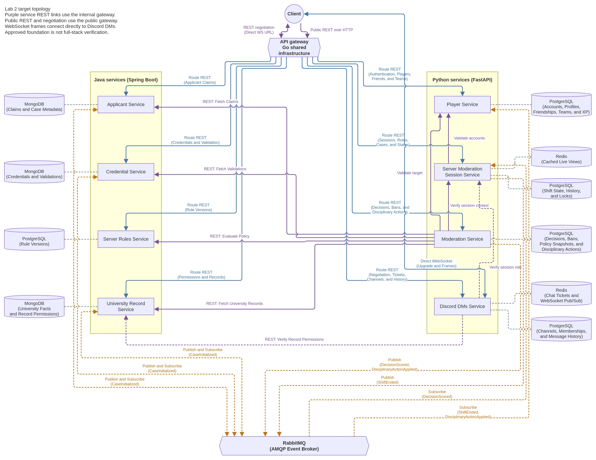

# Student ID, please

Student ID, please is a game about moderating a university Discord server. Junior Moderators inspect assigned university records and share findings in chat. The Moderator compares those findings with an applicant's claims and credentials, then accepts, rejects, flags, or bans the applicant.

The Common Project Repository, or CPR, contains the shared design, integration contracts, deployment, and service release pointers. Service implementations live in private repositories. Their container images are public.

## Architecture

Eight domain services own separate data. They communicate through REST, RabbitMQ events, and WebSocket chat. The gateway section below describes the Lab 2 target topology.

The figure and its [editable source](docs/architecture.drawio) are the unchanged legacy diagram, awaiting a human-authored Lab 2 update. Its WebSocket relay, direct inter-service REST links, and Session storage labels do not describe the target. [The human diagram handoff](docs/architecture.md#human-diagram-handoff) tracks the remaining work in issue #74.

[Architecture](docs/architecture.md) explains ownership and technology choices. [Game flows](docs/flows.md) describe a shift. [Integration principles](docs/integration.md) explain mocked and integrated deployments.

## Gateway

The selected gateway is shared Go infrastructure, separate from the eight domain services. In the Lab 2 target, all client-to-service REST traffic uses its public listener. All service-to-service REST traffic uses its internal listener, which is not publicly exposed. The gateway validates client identity, routes requests, and bounds task duration and concurrency. Domain services retain business authorization and data ownership.

Realtime negotiation uses REST through the gateway and returns a direct Discord DMs WebSocket URL. Clients connect to Discord DMs for the upgrade and chat frames. The gateway does not relay frames. Chat tickets, permissions, Redis delivery, and stored history belong to Discord DMs.

RabbitMQ events and service-owned storage connections are not REST routing paths and do not pass through the gateway.

[Gateway foundation PR #2](https://github.com/ChillGuysStudio/gateway-service/pull/2) at `9d298ab` has MaxNoragami's formal approval for listeners, process health, transport limits, graceful shutdown, and the container foundation. Identity and routing have separate owners, and application limits, realtime integration, and image publication remain follow-up work. A published gateway image and a running full stack are not yet verified. [Gateway delivery status](docs/architecture.md#gateway-delivery-status) records the scope and dependencies.

## Team and services

| Developer | Owned services | Stack | Source profile |
| --- | --- | --- | --- |
| Chicu Andrei | Moderation, Discord DMs | Python, FastAPI | `andrei` |
| Vremere Adrian | Applicant, Credential | Java, Spring Boot | `adrian` |
| Alexei Maxim | Server Rules, University Record | Java, Spring Boot | `alexei` |
| Cebotari Alexandru | Player, Session | Python, FastAPI | `alexandru` |

[Service references](docs/services/README.md) list public images and integration settings. The [submodule configuration](.gitmodules) lists private source repositories. The gateway is shared infrastructure, separate from each developer's two domain services.

## Start work

Read [CONTRIBUTING.md](CONTRIBUTING.md) for CPR rules. Follow [the development guide](docs/development.md) to run public images, install hooks, or check out only your two services. The default setup does not fetch private source.

## Documentation

- [HTTP conventions](docs/contracts/http.md)
- [Domain types](docs/contracts/domain.md)
- [Service APIs](docs/contracts/api.md)
- [Case initialization](docs/contracts/cases.md)
- [Simulation data](docs/contracts/simulation.md)
- [RabbitMQ events](docs/contracts/events.md)
- [Verification cases](docs/verification.md)
- [Release procedure](docs/releases.md)
- [GitHub checks and permissions](docs/github.md)

The [project board](https://github.com/orgs/ChillGuysStudio/projects/2) tracks team tasks.
